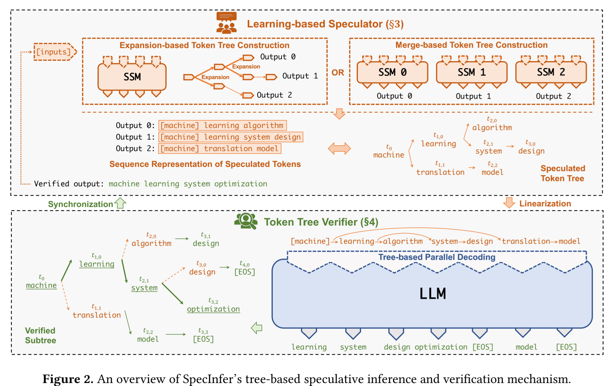

# [SpecInfer: Accelerating Large Language Model Serving with Tree-based Speculative Inference and Verification](https://arxiv.org/abs/2305.09781)

> 本文通讯作者为[Zhihao Jia](https://www.cs.cmu.edu/~zhihaoj2/)，
>
> CMU团队[CMU Catalyst Group](https://catalyst.cs.cmu.edu/)和[Parallel Data Lab](https://www.pdl.cmu.edu/)的工作。前者是Tianqi Chen运营的团队，后者是[Greg Ganger](https://www.pdl.cmu.edu/People/ganger.shtml)创建的团队，主要负责存储方向。

## 一句话总结概括

a tree-based speculative inference and verification system for LLM serving

## 背景

Speculative Inference：预测推理/投机采样。

 [一篇未完成的知识点总结](..\..\Study Notes\MLSYS\spec_decode.md) 

* lookahead
* 同系列的小模型进行预测
* 采用前几层进行预测
* 还有别的，还目前还没总结……

## 先前工作存在的问题

SpecInfer和之前的区别主要是simultaneously consider a diversity of speculation candidates instead of just one as in existing approaches。

个人认为可以理解为SpecInfer牺牲了计算量而提高了预测的成功率。

## 难点

1. 搜索空间大
   * 现在LLM vocabularies很大
   * 最大化speculative性能需要预测多个tokens，而不是仅仅一个token
2. 需要验证预测出来的token和真实推理的是一样的
   * 提出了一个multi-step speculative sampling：专门为小模型服务的验证服务
   * tree-based parallel decoding mechanism：同步验证多个token

## 解决方案

## 创新点

## 实验评估

## Q&A

