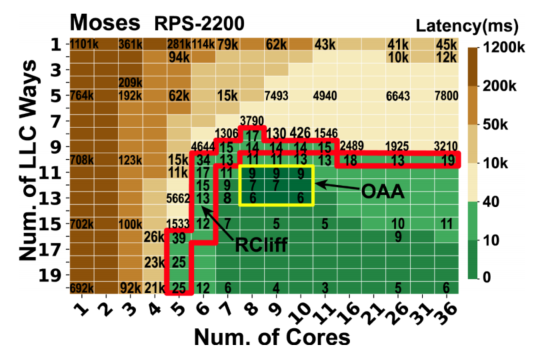

# [Intelligent Resource Scheduling for Co-located Latency-critical Services: A Multi-Model Collaborative Learning Approach](https://arxiv.org/abs/1911.13208)

> 北航刘磊老师的工作

## 一句话总结概括

解决调度中的断崖问题

数据中心服务器中各类任务并存，保证服务质量（QoS）的难题

* 引用类型多样，多线程、硬实时任务、软实时任务、大算力需求任务
* 硬实时任务：Latency-critical的任务，比如Google Map、搜索引擎、购物
* 软实时任务：延迟不敏感的任务

---

系统层解决方案

* Interference during colocation
  * 对调用时进行干扰
* Scheduling
  * Avoid co-scheduling of apps that may interfere【Nathuji’10，Mars‘13，Delimitrou’14】
    * May require offline knowledge
    * Limit colocation options

* Resouce partitioning【Sanchez‘11，Lo’15】
  * Partition shared resources

---

现存问题：

* 对复杂、实时多任务的快速响应 VS. one-size-fits-all的算法：基于经典启发式和性能模型的调度需要**较长的收敛时间**(可以是一个思考点)

  * 使用OS的资源管理调度算法、任务调度算法（FCFS、短任务优先、CFS完全公平的任务调度）是rule-based的，在面对复杂的应用情况，力不从心
  * 启发式（try-and-error）、性能模型的机制，会遇到各种问题：收敛时间长、仅得到次优解……

* 输出稳定的服务质量 VS. **资源断崖**：云服务质量瞬间剧烈抖动

  * 资源断崖（Resource Cliff，RCliff）：当减少“一点资源”，性能发生激励式的下降/当分配“一点”资源，性能发生明显的提升。采用“启发式”的分配算法，会频繁产生断崖的问题，因为启发式的方法在根源上是一种试错的方法。

    

    如图所示，越往右下角分配的Cache Way和Core越多。

    * 存在一个明显的RCliff界限
    * 调度空间中存在满足QoS的最优资源分配（OAA）
    * 不同应用RCliff的表现也不同，比如有的只因为Core表现出RCliff，有的如上图在Cache Way和Core上都表现出RCliff

* 低开销的调度 VS. 调度多维度多样化的资源： 很难实现多层次、多种资源的最优协同调度，其他次优解的开销也很大

比如[PARTIES[ASPLOS'19]](https://dl.acm.org/doi/10.1145/3297858.3304005)，需要40秒调度5个云服务；且优于资源断崖，在调度过程中QoS发生多次剧烈抖动。