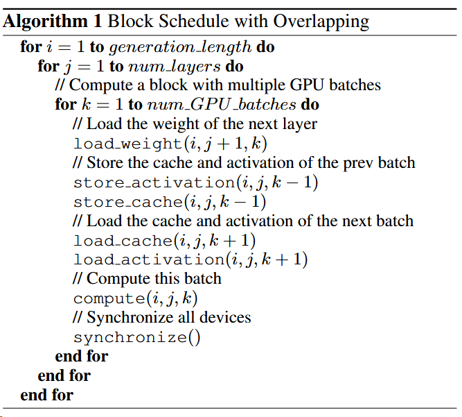
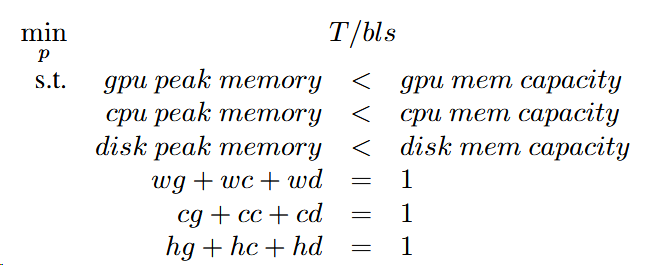
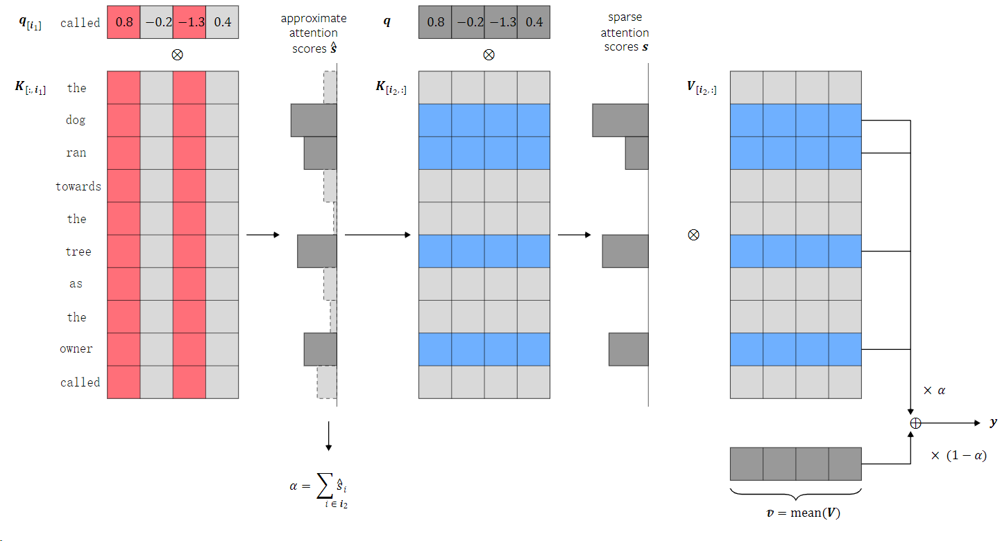

# FlexGen: High-Throughput Generative Inference of Large Language Models with a Single GPU

[FlexGen](https://dl.acm.org/doi/10.5555/3618408.3619696)

## Abstract

> Motivated by the emerging demand for **latency-insensitive tasks** with batched processing, this paper initiates the study of high-throughput LLM inference using limited resources, such as a single commodity GPU.

本文的主要是针对解决**延迟不敏感任务**的新兴需求，提出了一个在GPU内存有限的情况下进行LLM推理的高吞吐量引擎。

> By solving **a linear programming problem**, it searches for efficient patterns to store and access tensors.

通过线性规划问题来搜索**如何存储和访问张量**。

> FlexGen further compresses the weights and the attention cache to 4 bits with negligible accuracy loss.

**模型量化**：在几乎没有精度损失的情况下将weights和attention cache降到4bit

> These techniques enable FlexGen to have a **larger space of batch size** choices and thus significantly increase maximum throughput.

通过上述方法，FlexGen有着**更大的batch size处理空间**来实现**更大的吞吐量**

## Introduction

**大模型的挑战**：

> These models can have billions, if not trillions of parameters (Chowdhery et al., 2022; Fedus et al., 2022), which leads to extremely high computational and memory requirements to run.
>
> 对计算和内存要求高

-> 如何降低LLM推理资源要求

->本文重点关注面向吞吐量的生成推理

**当前的需求**：

> One key characteristic of these tasks is that they often require running LLM inference in batches over a large number of tokens

存在一部分大模型推理，需要对大量token批量运行LLM推理，且对延迟不太敏感。

**先前降低LLM资源需求的工作**

> Prior efforts to lower resource requirements of LLM infer- ence correspond to three directions: 
>
> 1. **model compression** to decrease total memory footprint (Dettmers et al., 2022; Yao et al., 2022; Frantar et al., 2022; Xiao et al., 2022); 
>
>    模型压缩
>
> 2. **collaborative inference** to amortize inference cost via **decentralization** (Borzunov et al., 2022); 
>
>    利用CPU协助推理
>
> 3. **offloading** to utilize memory from CPU and disk (Aminabadi et al., 2022; HuggingFace, 2022).
>
>    offload到CPU和disk上

**缺陷**

> 1和2建立在GPU内存能放下模型的基础上：很难支持单卡运行175B的大模型
>
> 3的IO调度和tensor放置使得其在单个GPU上性能很差：在小批量要求上，可能效果很差

**本文提出解决方案**

> 在单个商用GPU上设计高效的卸载策略

**挑战**

> 1. 如何设计有效的卸载策略
>
>    主要有三种tensors需要卸载：weights，activations和KV cache
>
>    需要考虑：what tensors to offload, where to offload them within the three-level memory hierarchy, and when to offload them during inference
>
>    The batch-by-batch, token-by-token, and layer-by-layer structure of the computation forms a complex dependency graph where there are multiple ways to conduct computation.
>
> 2. 如何制定有效的压缩策略
>
>    when combining compression with offloading for high-throughput inference, the I/O costs and memory reduction of the weights and KV cache become more important

## Related Work

> Recent years have witnessed the emergence of systems specialized for LLM inference, such as FasterTransformer (NVIDIA, 2022), Orca (Yu et al., 2022), LightSeq (Wang et al., 2021), PaLM inference (Pope et al., 2022), TurboTransformers (Fang et al., 2021), DeepSpeed Inference (Aminabadi et al., 2022), and Hugging Face Accelerate (HuggingFace, 2022).
>
> 但大多数都专注于具有高端加速器**面向延迟**的场景，限制了在商品级GPU**面向吞吐量**的推理的部署。

> To enable LLM inference on such commodity hardware, offloading is an essential technique — as far as we know, among current systems, only **DeepSpeed Zero-Inference** and **Hugging Face Accelerate** support offloading.
>
> 但都是继承了training systems中的offload方法，忽略了推理的计算属性。

> Another attempt to enable LLM inference on accessible hardware is collaborative computing proposed by Petals (Borzunov et al., 2022).
>
> 协作计算

> sparsification (Hoefler et al., 2021; Frantar & Alistarh, 2023) and quantization (Kwon et al., 2022; Yao et al., 2022; Park et al., 2022; Xiao et al., 2022; Frantar et al., 2022; Dettmers et al., 2022)
>
> 稀疏化和量化

> memory optimizations and offloading have been studied for training (Huang et al., 2020; Ren et al., 2021; Steiner et al., 2022) and linear algebra (Jia-Wei & Kung, 1981; Demmel, 2013).
>
> 内存优化和卸载、线性代数

## Background

**Generative Inference**

> A typical LLM generative inference task consists of two stages: 
>
> 1. the prefill stage which takes a prompt sequence to generate the key-value cache (KV cache) for each transformer layer of the LLM;
> 2. the decoding stage which utilizes and updates the KV cache to generate tokens step-by-step, where the current token generation depends on previously generated tokens.

具体 to be continued

## Offloading Strategy

> 

**定义了以下约束**

> * A square can only be computed if all squares to its left on the same row were computed.
>
>   左边的算完才能算右边的
>
> * To compute a square on a device, all its inputs (weights, activations, cache) must be loaded to the same device.
>
>   输入需要load到同一个设备上
>
> * After being computed, a square produces two outputs: activations and KV cache. The activations should be stored until its right sibling is computed. The KV cache should be stored until the rightmost square on the same row is computed. 
>
>   计算后生成激活值和KV cache，激活值存到下一层完成计算，KV cache存到该行所有层完成计算
>
> * At any time, the total size of tensors stored on a device cannot exceed its memory capacity.
>
>   分配的内存不能超过设备内存

**计算调度**

> 
>
> 以往的是一行一行的，本论文提出的是一列一列的计算，就可以避免了重复加载model。
>
> 但会面临一个问题，CPU和disk内存的有限的。所以采用了图b中的方法：zig-zag block schedule
>
> Besides, we propose another more advanced and I/O-optimal schedule,
>
> 提出了另一种更先进的IO优化调度，但仅实现了block的调度，且在文章中没有详细说明。
>
> 
>
> 通过异步传输+计算，实现计算和通信重叠。

**张量放置**

> 用w表示权重，h表示激活值，c表示kv cache。记录在gpu memory、cpu memory和disk上的百分比。
>
> 且有三个可以思考的分发角度
>
> * model granularity
> * layer granularity
> * tensor granularity
>
> Coarser granularity leads to lower runtime overhead but it is less flexible and its cost is difficult to analyze.
>
> 目前采用layer granularity

**Computation delegation**

> the computation of attention scores during decoding is I/O-bounded
>
> CPU计算the attention score可以减少IO通信，所以假如kv cache还没存到gpu上时可以用CPU进行计算

**成本模型**

> * latency
>
>   用$T_{pre}$表示一个层在预处理阶段的平均latency，$T_{gen}$表示一个层在decoding阶段的平均latency
>
>   然后假设完全重叠，那么平均latency是数据从CPU读到GPU、GPU写到CPU，disk读到CPU、CPU写到disk，计算 这五部分中的最大值。
>
>   通信的估计通过数据量，计算的估计通过计算事件
>
> * peak memory usage of the GPU、CPU and disk

**搜索策略**

> 包含十一个元素：block size bls, GPU batch size gbs, weight placement wg, wc, wd, activation placement hg, hc, hd, and KV cache placement cg, cc, cd.
>
> 先确定vls和gbs，再确定wg，wc，wd，hg，hc，hd，cg，cc，cd。从而减少了搜索空间
>
> 设置一个线性规划问题
>
> 
>
> 考虑了内存峰值，峰值超过的时候手动调整

**拓展到多GPU**

> Tensor parallelism can reduce the single-query latency
>
> Pipeline parallelism can achieve good scaling on throughput due to its low communication costs
>
> 采用了Pipeline parallelism。并采用微批次的方法和迭代级调度

## Approximate Methods

> However, the inference throughput can be greatly boosted with negligible accuracy loss by allowing some approximations, because LLMs are typically robust to careful approximations.

**Group-wise Quantization**

> use a fine-grained group-wise asymmetric quantization method (Shen et al., 2020).

> For each group, we compute the min and max of the group elements and quantize each element x into b-bit integers by
>
> $x_{quant}=round(\frac{x-min}{max-min}\times(2^b-1))$
>
> The tensors are stored in the quantized format and converted back to FP16 before computation.
>
> 在传输前转换为4bit精度，传输后转换回来再计算。并且该转换不在CPU上运行

**Sparse Attention.**

> 自注意力有稀疏性，只计算top 10% attention scores
>
> After computing the attention matrices, for each query, we calculate the indices of its Top-K tokens from the K cache. We then simply drop the other tokens and only load a subset of the V cache according to the indices.
>
> [参考资料](https://arxiv.org/html/2312.04985v1)
>
> 应该是这个意思？但没太懂具体的计算。