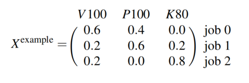
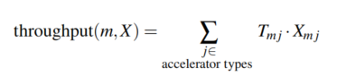

# Heterogeneity-Aware Cluster Scheduling Policies for Deep Learning Workloads

> Deepak Narayanan , Keshav Santhanam, Fiodar Kazhamiaka, Amar Phanishayee, Matei Zaharia
>
> Microsoft Research, Standford University

[Deepak Narayanan](https://deepakn94.github.io/#about)在OSDI 2020发表的一篇工作，先前其在Stanford，现在在Nvidia

## 总结概述

在调度DL training任务时考虑不同加速器的异构性，并且将传统的调度策略建模成一个优化问题，通过求解优化问题得到最优的资源分配方式。

## 先前工作存在问题

随着时间发展，一个系统会积累很多的加速器类型，如何在考虑公平性或makespan的情况下给多用户分配资源存在困难

## 难点

1. Performance Heterogeneity

​		不同的任务适合的加速器可能是不一样的。为了满足SLO，可能调度到资源并不适合任务。

2. Generality across Policies

​		目前的调度可以支持分层调度，在不同层级进行调度。但一些新的工作，假如关注公平性后，可能不能轻易地使用以上的调度策略

3. Colocation and Placement Optimizations.

​		目前相关工作有空间共享和位置敏感性，考虑了性能感知后，这些优化可以获得更好的性能。

## 解决方案

### System Overview

1. 仲裁（arbitrate）各个资源

2. 根据用户要求的策略进行分配

3. Gavel调度机制收到分配结果，然后如实模拟

---

**Heterogeneity-Aware Policies**

1. 提出了分配矩阵X和吞吐量矩阵T

   

   X的一列加起来为100%

   

2. 有效吞吐量的计算就是X和T对应位置的积的和

   

3. 共享空间的（SS）可以通过加2个job并行的组到X

   

4. 位置敏感性考虑consolidated和unconsolidated

   consolidated意思尽可能将任务计算过程中涉及的加速器尽可能放在同一台服务器上，unconsolidated意思是任务的加速器没有位置要求的约束

---

**Round-based Scheduling Mechanism**

按轮次进行对应的调度，在每一轮，先按优先级进行分配，并保证一个任务不会分配在多个机器上。

---

**Throughput Estimator**

将job映射到预先进行的相关job中，取结果最接近的相关job的吞吐量

---

**Limitations and Non-Goals**

本文的局限是提供了调度，但没有提出新的调度方式，但提供了api接口

---

### Scheduling Policies

**Max-Min Fairness as an Optimization Problem**

> The classical Least Attained Service (LAS) policy

但这种传统的LAS策略在异构机器上不适用，因为每台机器的性能是不一样的。所以引入一个时间平均分配的$X^{equal}_{m}$来作为中间量，采用下面的公式，使得不同工作在异构机器上有可比性。

一个调整的例子：

---

**Minimize Makespan**

最小化makespan：最小化持续时间/吞吐量最大值 = 所有任务持续时间都不长

---

**Minimize Finish-Time Fairness (Themis)**

最小化完成时间：和独享1/n资源完成时间的比率。模拟的是n个用户在同时使用。

---

**FIFO**

---

**Shortest Job First**

---

**Minimizing Total Cost and Cost subject to SLOs**

---

### Hierarchical Scheduling Policies

采用water filling的方法，有点像循环加水，然后明显多的那杯就是bottlenecked job，那先加其他杯

### Properties of Policies

**Sharing Incentive**

至少要和平均分配资源性能一样好

---

**Colocation**

有托管的解决方案至少和没有托管的一样好

---

**Pareto Efficiency**

> Allocations of max-min fairness policies with water filling are Pareto efficient: that is, the allocation for a particular job cannot be increased without decreasing the allocation for another job

---

**问题**

实现了 Sharing Incentive和Pareto Efficiency的情况下，无法证明其strategy proofness。

### Scheduling Mechanism

和之前工作的不同

* 调度是异构的
* 实际的资源调度需要尊重分配策略
* 需要保证一个job的多个组合不会在同一时间运行

资源不足的情况下如何进行

* 更好的调度资源不足很容易带来长时间的饥饿。
* 本文解决方案是降低每一次的粒度