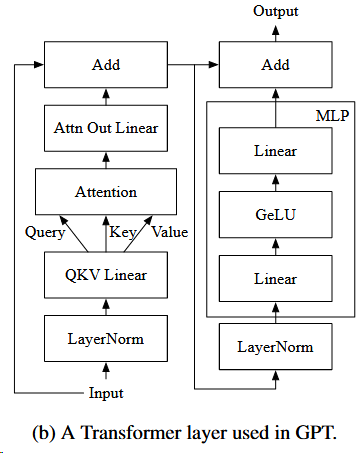
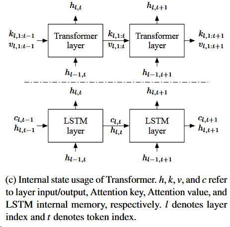
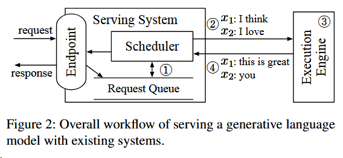
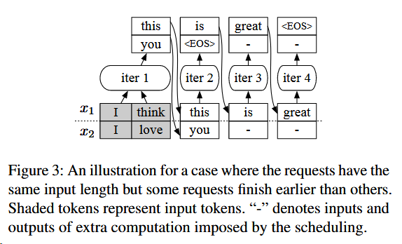
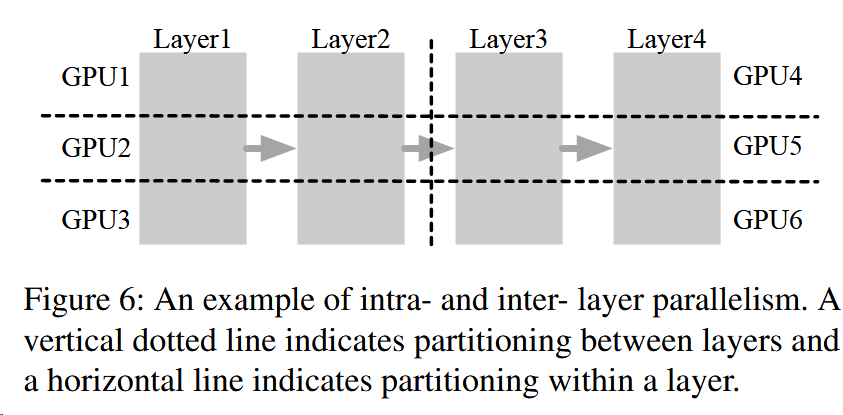
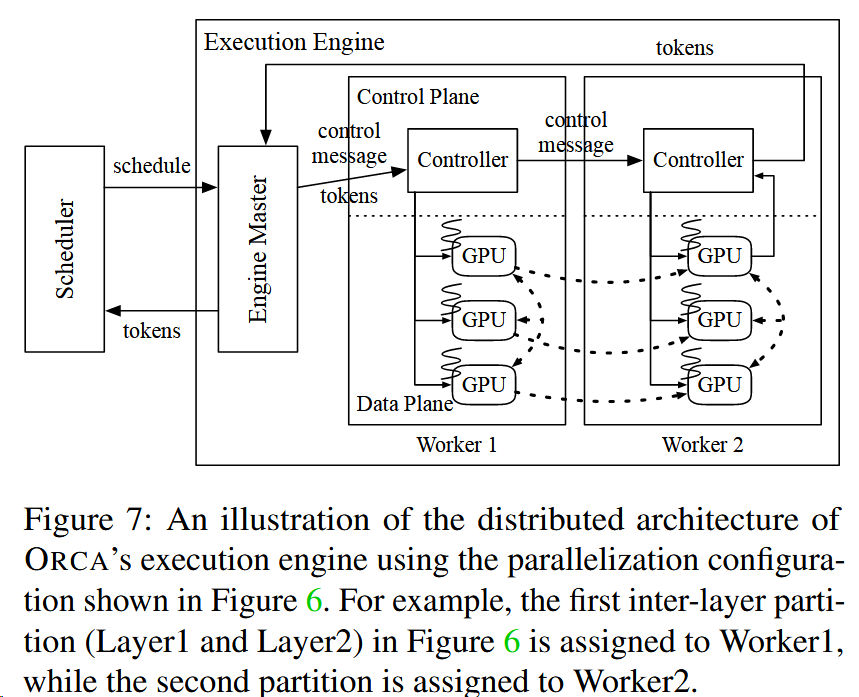
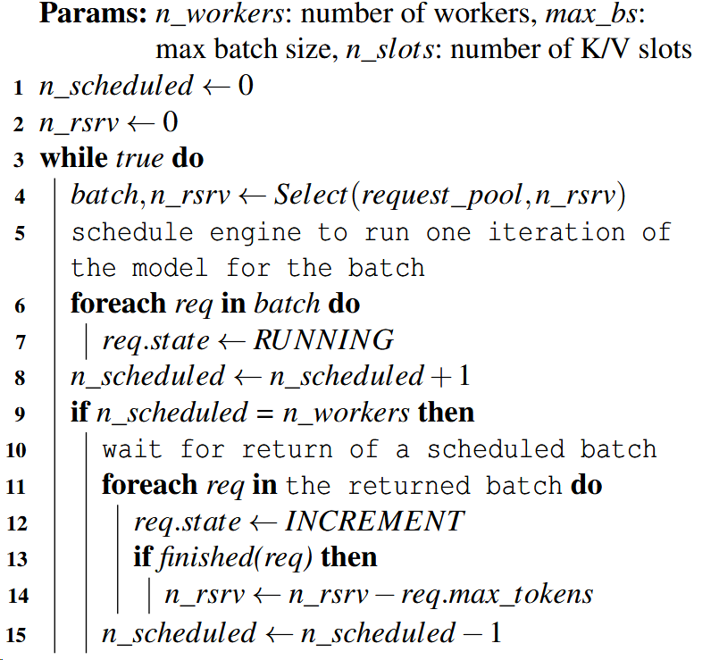
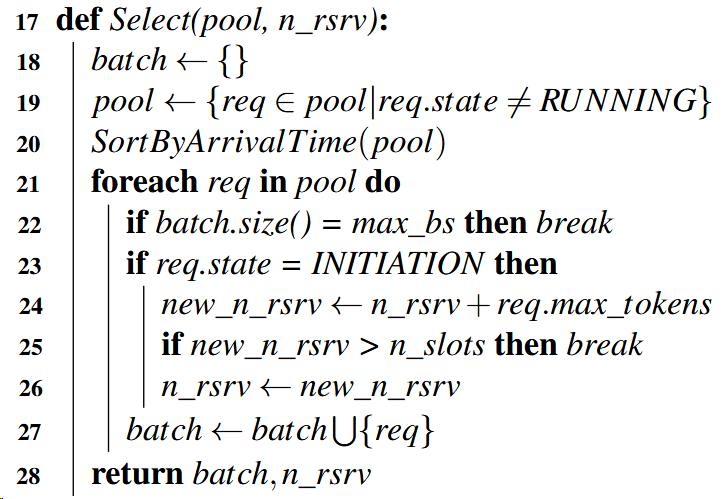
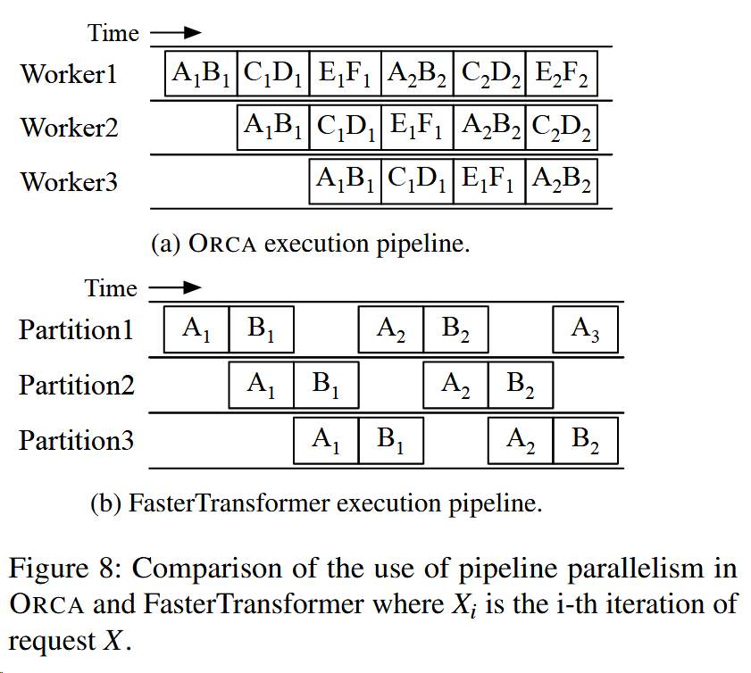

# Orca, A Distributed Serving System for Transformer-Based Generative Models

[ORCA OSDI22论文](https://www.usenix.org/conference/osdi22/presentation/yu)

# 挑战

当前处理方法是按批次的，存在时间浪费的现象。

* 一批请求输入，即使某一请求的计算完成了，也需要等待同一批次所有内容才能输出。
* 一批新的请求在批次确定后进入，需要等待所有请求完成就能进入。

# 创新点

采用迭代级别的调度，更细粒度。新的模型只需要等待一次迭代就可以进行处理。

**会带来新的挑战：**

* 张量可变，对transformer模型的请求无法以批处理形式处理。

所以采用selective batching的方法。这部分单独处理，其他都采用批处理。

# 背景知识

## GPT推理过程

> 
>
> 就是之前文章的自回归部分
>
> At a high level, the Attention operation computes a weighted average of the tokens of interest so that each token in the sequence is aware of the other. It takes three inputs, query, key, and value, computes dot products of the query (for the current token) with all keys (for the tokens of interest), applies Softmax on the dot products to get weights, and conducts weighted average of all values associated with the weights.

> 
>
> Prior to the Attention operation, there are the layer normalization operation (LayerNorm) and the QKV Linear (linear and split operations to get the query, key and value). Operations performed after Attention are, in order, a linear operation (Attn Out Linear), an add operation for residual connection (Add), layer normalization operation (LayerNorm), the multilayer perceptron (MLP) operations, and the other residual connection operation (Add).

> 
>
> Transformer layer的输入是越来越多的，1：t的；LSTM的输入长度是不变的。

## ML inference serving systems

实现高的加速器利用率，主要依靠批处理

* 可以将多个请求的输入张量合并成大的输入张量
* 可以重用加载的模型参数

> The main component of the serving system (e.g., Tri- ton [7]) is the scheduler, which is responsible for (1) creating a batch of requests by retrieving requests from a queue and (2)scheduling the execution engine (e.g., FasterTransformer [4]) to process the batch. The execution engine (3) processes the received batch by running multiple iterations of the model being served and (4) returns the generated text back to the serving system.

服务系统主要依靠调度器，调度器则主要负责

* 从队列中检索请求，创建1个批次的请求
* 调度处理引擎去处理一个批次请求

处理引擎

* 运行服务模型的多次迭代来处理接收到的批次
* 将生成的文本返回到服务系统

以下是其中一个示例

> 

# 挑战

## 对于提前完成和晚加入的请求

服务系统和执行引擎只在以下情况交互信息

* 服务系统调度下一批次的请求到空闲的引擎上
* 引擎完成当前批次请求的处理

所以就会面临

> 
>
> 问题1：同一批次有的请求很早就完成了，但仍需要等待其他请求完成才能返回。
>
> 问题2：这时候新的请求进来了，也无法调度给引擎处理，即使当前引擎是有能力处理的。

提出的解决方案：**Iteration-level scheduling**（迭代级调度）

> At high level, the scheduler repeats the follow- ing procedure: 
>
> (1) selects requests to run next; 
>
> (2) invokes the engine to execute one iteration for the selected requests; 
>
> (3) receives execution results for the scheduled iteration.
>
> 
>
> 这里可以理解为一次迭代生成一个新的token。

## 在迭代次调度，如何进行批处理

批处理需要

* 操作是相同的
* 输入的tensors也是相同的

无法批处理的情况

* 如Figure图4中的$x_3$和$x_4$，两个请求都处于启动阶段，且输入的token长度不一样。
* 如Figure图4中的$x_1$和$x_2$，两个请求都在增长阶段，且要生成的token索引不一样，比如$x_1$是第三个token，$x_2$是第二个token。
* 如Figure图4中的$x_1$和$x_3$，两个请求分别处于启动阶段和增长阶段

那么就会存在很多无法批处理的情况，且这些情况随着数据越来越大，就越来越小可能可以批处理。

提出的解决方案：**Selective batching**（选择性批处理）

> In the canonical batching mechanism, at each iteration, a Transformer layer takes a 3-dimensional input tensor of shape **[B, L, H]** generated by concatenating multiple **[L, H]** in- put tensors of requests in a batch, where **B** is the batch size, **L** is the number of tokens processed together, and **H** is the hidden size of the model.

> For example, in Figure 3, “iter 1” (initiation phase) takes an input tensor of shape [2, 2, H] and “iter 2” (increment phase) takes a tensor of shape [2, 1, H]. However, when the scheduler decides to run an iteration on batch (x1, x2, x3, x4) in Figure 4, the inputs for requests in the initiation phase (x3 : [2, H] and x4 : [3, H]) cannot coalesce into a single tensor of shape [B, L, H] because x3 and x4 have different number of input tokens, 2 and 3.

于是，其提出，将Figure图4中的3和4合并。而其中涉及到区分3、4的注意力计算，本文采用了cuBLAS来解决这个问题。

> For instance, the aforementioned input tensors for x3 and x4 can compose a 2-dimensional tensor of shape [$∑$ L, H] = [5, H] without an explicit batch dimension.

那么，如下图所示。先采用Split分成四块，在每一块tensor中独立地计算Attention输出，然后再合并。

并使用Attention K/V manager保留keys和value，直到scheduler让其清楚数据。

> 

# ORCA design

### Distributed Architecture

> parallelization
>
> * intra-layer parallelism
>   * splits matrix multiplications (i.e., Linear and Attention operations) and their associated parameters over multiple GPUs
> * inter-layer parallelism
>   * splits Transformer layers over multiple GPUs
>
> 
>
> 上图是一个层间和层内并行的样例，使得模型在六个GPU上并行。
>
> 
>
> 每个Worker代表inter-layer parallelism的一个部分。例如worker1代表GPU 1、2、3，代表着图6中处理着Layer1和2的部分。
>
> * Engine Master会先把token和一些信息发送给Worker1
> * 中间的Worker(Worker1) Controller
>   * 会发送适当的kenels函数给对应的GPU，比如获取之前保存的对应该request的KV Cache地址
>   * 也会不等待Worker1完成任务，**直接**发送控制信息到下一个Worker（Worker2）
> * 最后的Worker(Worker2) Controller
>   * 等待已发送的GPU内核完成，获取token并返回到Engine

且当前的分布式推理系统，都会用到CPU-GPU通道-NCCL来交换信息，会有性能开销。

OCRA将控制信息和张量数据传输分开，利用NCCL来传输中间张量数据（图7中的虚线）；利用不涉及GPU的通道gRPC来传输控制信息。

### Scheduling Algorithm

* ensure iteration-level first-come-first-served (FCFS) property

* diminishing returns to increasing the batch size and GPU memory constraint

  batch size 增加+GPU memory 限制会导致returns的减小。

  * has a notion of a max batch size: the largest possible number of requests within a batch

    限定了1个batch中可能容纳的最多request数，并提供给系统操作者调整。

  * requires the ORCA scheduler to be aware of the remaining size of pre-allocated memory regions for the manager

    ORCA调度器需要知道预分配内存区域的剩余大小。

> 
>
> 
>
> | 缩写        | 含义                                                         |
> | ----------- | ------------------------------------------------------------ |
> | n_scheduled | the number of currently scheduled batche                     |
> | n_rsrv      | the number of currently reserved slots                       |
> | max_tokens  | the maximum number of tokens that a request can have after processing |
> | n_slots     | the size of memory region (in terms of slots) allocated to the Attention K/V manager |
>
> 23-25行是考虑GPU内存限制
>
> max_tokens就是限定输出的长度
>
> 然后假如加上这个request超出了当前能容纳的内存，就不让该request进

### Pipeline parallelism

9-10行，调度器保证数据够的情况下，每个worker都在工作。

> 
>
> 和以前最主要的区别现在可以实现batch和batch之间的流水线，而之前不能。
>
> 之前一个Batch AB传入，就必须完成AB计算后才能进行下一个Batch。
>
> 但ORCA这样是不是也会收到GPU Memory的限制？
