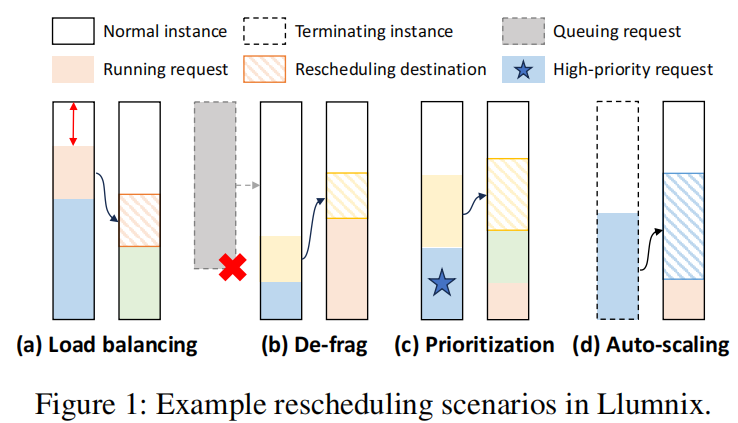
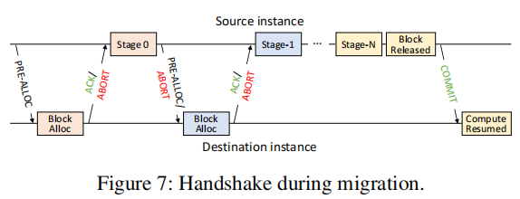

# [Llumnix: Dynamic Scheduling for Large Language Model Serving](https://arxiv.org/abs/2406.03243)

Alibaba在OSDI 2024的一篇工作

> 作者信息

## 一句话总结概括

像CPU上下文切换一样进行多节点调度

## 背景

* LLM的性质
  * workload heterogeneity：不同的请求的异质性（context len、seq len等等）
  * execution unpredictability

## 先前工作存在的问题

* 先前的工作（vllm，fasttransformer，Orca）主要做的工作都是最大化单个节点的输出，缺乏针对多节点的调度策略。
* 另外一批工作（Deepspeed-mii、AlpaServe、 Triton inference server等）则主要延续了DNN的schedule策略。

## 难点

* Isolation
  * 各个工作无法隔离，抢占会互相影响
* Fragmentation
  * 碎片化导致长队列一直被阻塞
* Priorities
  * 目前的推理系统不会考虑请求的优先级

## 解决方案

1. 图a的负载均衡(*load balancing*)，通过减少请求的动态不确定的影响。但会带来新的问题： higher **memory fragmentation** and longer **queuing delays** of long inputs probably.
2. 图b的去碎片化(*de-fragmentation*)，通过去碎片化获得更完整的内存空间，使得长请求可以被调度。
3. 图c的优先级(*prioritization*) ，通过调度使得高优先级的请求获得更低的负载和更少的干扰，为高优先级请求保留了更多的资源。
4. 图d的自动缩放(*auto-scaling*)，这个没看懂是啥。to drain out an instance to be terminated(1-d) or saturate a new instance more quickly.

* 为了去碎片化，Llumnix会把queue排第一位的序列的空间预先分配在虚拟内存中，尽管物理上它还未进入推理。通过这种方法，可以给长队列迁移或预留出足够的空间。
* 虚拟内存利于调度的启发式方法：逐渐增加其虚拟内存，直到达到真正的内存需求。我的理解是，逐渐分配内存，比如chunked prefill等情况，一步步分配内存。而Llumnix采用的是queue头的内存需求直接转化为虚拟内存，这得益于其灵活的migration调度。
* 为了保证请求的优先级差异，Llumnix通过提供一个Headroom给高优先级请求，这使得高优先级请求有预留的充足空间来进行推理。

伪代码：

* 计算虚拟空间的使用
  * 假如是队头的req，返回其需要的内存空间
  * 假如是Fake（该instance被Terminating了），返回无穷
  * 否则返回物理空间使用+Headroom

---

假如需要开始Migration

1. Stage0：（橙色计算块）继续计算，并且同时进行之前计算出来的（绿色内存块）KV Cache迁移。
2. Stage1：（蓝色计算块）继续计算，并且同时进行在Stage1时计算出来的（橙色内存块）KV Cache迁移。
3. 因为随着传输比计算快，所以随着Stage的进展，需要传输的数据越来越少，传输的时间也越来越短。
4. 直到Stage N的时候，只生成了一个iteration的KV Cache，这时候就停止原instance的继续计算，并传输KV Cache到新的instance。就能够在很短的时间内完成了数据迁移。

这里引入了**虚拟机实时迁移**的概念，但也会带来新的挑战：可能在迁移过程中两边出现内存满了 或 推理完成了。【异常处理问题】

1. 在每一个Stage迁移前，原instance会发送疫情PRE-ALLOC或ABORT请求，前者包含需要的块信息。如果在新的round中，
2. 在每一个Stage迁移后，目标instance会发送一个ACK或ABORT请求。

## 创新点

1. 带有isolation、priority的调度
2. 动态迁移实现上下文切换机制

## 实验评估

## Q&A

Q：自由度是什么？它的Batch Size是对应是目前推理的Batch Size还是可支持的最大Batch Size。

* 是目前推理的Batch Size，自由度就是对于该节点的这个batch，可以增长的空间的一个评估。