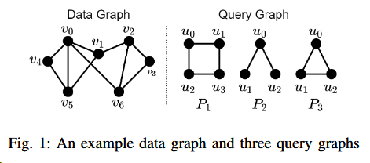
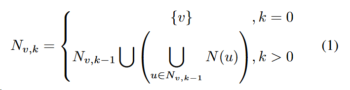
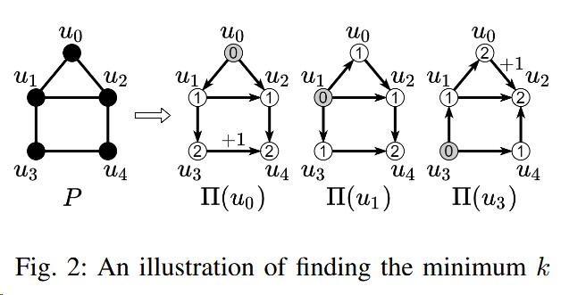
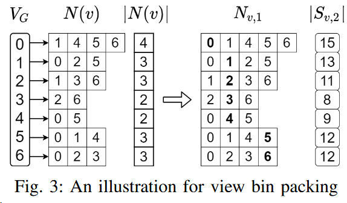
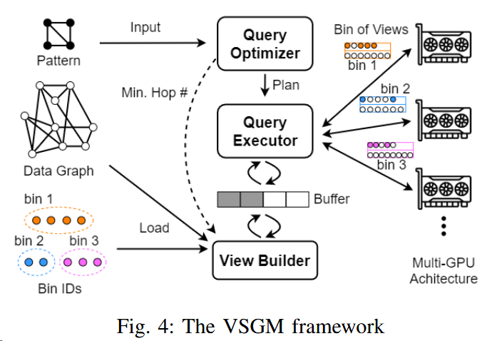

# VSGM:View-Based GPU-Accelerated Subgraph Matching on Large Graphs

A paper at the SC 2022 conference.

A view-based method to hide communication overhead and improve GPU utilization.

# **Challenges**:

- Now the works of subgraph matching **cannot handle many large graphs** (especially those in industry) that easily exceed the memory capacity of a GPU.
- Inter-partition search requires to repeatedly load the cross-partition neighbors of the candidate vertices on demand for matching. **GPU threads are idle when waiting for required data.**

PBE: A work supports subgraph matching on large graphs by partitioning a data graph, so that each partition fits in GPU memory.

# Background of Subgraph Matching

**Data_graph:**

G = (VG, EG)

Data graph is undirected, unlabeled and simple (i.e., no self-loops and multiple edges) in this work

**Query_graph(also_called_a_pattern):**

P = (VP , EP )

Query graph is undirected, unlabeled and simple (i.e., no self-loops and multiple edges) in this work

**Neighbor_set_of_a_vertex_v: **

N(v)

**Match(also_called_isomorphic):**

subgraph H match subgraph P means that there exists a mapping f : VP → VH , such that (u1, u2) ∈ EP if and only if (f (u1), f (u2)) ∈ EH .

**Subgraph_matching:**

Given a data graph G and a pattern P, find all matches (or instances) of P in G.

The matching of P follows a match order. A match order is essentially a permutation of the vertices in P .

**The_set_of_all_match_orders_of_P:**

$Π$p

For efficient subgraph matching, it is generally required that for each π ∈ $Π$P , the subgraph of P induced by a prefix of π is a connected subgraph.

**The_set_of_match_orders_starting_from_a_vertex_u_in_P:**

$Π$P ($u$)

$Π$P ($u$) ⊆ $Π$P

**The_matching_process:**

**intra-partition search**: searches all matches within the partition.

**inter-partition search**: enumerates all cross-partition edges to find all the remaining matches

- brings redundant computation as a cross-partition edge can be mapped into two vertices of the pattern with multiple match orders simultaneously.
- causes higher PCI-e communication overhead as it needs to fetch the data graph from the host memory.

# Background of GPU-based solutions

**the-work-assuming-the-entire-data-graph-can-fit-in-the-memory-of-a-GPU:**

- **GPSM** adopts **a filtering-and-joining approach** to leverage the power of massive parallelism
- **GSI** prevents conducting the same join operation twice in GPSM's the edge-based join operation, which requires a two-step output scheme. **GSI** also proposes a data structure, called **Partitioned Compressed Sparse Row**, to reduce the access latency of GPU memory.
- **GunrockSM** uses **a filtering-and-verification strategy** built on a graph analytic framework called **Gunrock**.

- **cuTS** proposes **a hybrid BFS-DFS strategy** to limit memory usage when enabling high parallelism.

**the-work-not-assuming-the-entire-data-graph-can-fit-in-the-memory-of-a-GPU:**

- **PBE**
  - proposes partition-based enumeration to divide a data graph into multiple partitions and ensure that each partition (only with intra-partition edges) fits in GPU memory.
  - uses shared-execution to group different match orders together so that fewer match plans are generated by combining strict-equivalent groups of match orders.
  - conducts the matching by extending each inter-partition edge in one group of match orders at a time.

# VIEW-BASED GRAPH PREPARATION

avoid on-demand data loading by **preparing the multi-hop neighbors** for each source vertex.

**hop:**

In a graph, a "hop" represents moving from one vertex to another through an edge.

Here is a example of graph matching.

# View Construction

**vertex_level:**

$l_{u'_{i}}$

the shortest-path distance between $u'_{0}$and $u'_{i}$ in the subgraph of P induced by {$u'_{0}$,$u'_{1}$, · · · , $u'_{i}$}

**edge_level:**

$$l_{(u'i,u'j)}$$

the number of hops that is needed to match P by following $Π$.$Π$ typically signifies the order of vertex traversal or vertex visiting sequence.

**the_k-hop_neighbors_of_a_vertex_v:**

Nv,k

In fig2, Nv4,0 = {v4}, Nv4,1={v0,v4,v5}

Given a data graph G, all the matches of a pattern P starting from a source vertex $v ∈V_{G}$ can be obtained from $S_{v,k}$, if there exists a match order $π ∈ Π_{P} $for which the maximum edge level $l_{max}$ is no greater than $k$. The example is also in fig1.

 **the_k-hop_view_of_v:**

Sv,k

visiting the (k − 1)-hop neighbors of v and grouping their adjacency lists (i.e., 1-hop neighbors) in the CSR format.

In fig1, Sv4,2={N(v0,v4,v5)}

The way to compute kmin for each $Π_{P}(U)$: construct a BFS tree on P with u as the root. When there is no edge between any two nodes at the largest level, kmin is the largest level, otherwise kmin is the largest level plus one.

Then pick the minimum kmin among the kmin for all $\Pi_{P}(U)\subset\Pi_{P}$.

Here is a example of computing kmin:

# View Bin Packing

**NP-hard_bin_packing_problem: **

The **bin packing problem** is an optimization problem, in which items of different sizes must be packed into a finite number of bins or containers, each of a fixed given capacity, in a way that minimizes the number of bins used.

NP-hard implies that finding an optimal solution (i.e., using the minimum number of bins) is believed to be computationally difficult and may require an exponential amount of time in the worst case.

Two algorithms are proposed here.

- **Next-Fit Bin Packing:**
  - If M=15, next-fit generates five bins (v0),(v1),(v2,v3),(v4,v5),(v6).
  * the time complexity is $O(|V_{G}|\times(|E_{G}|/|V_{G}|)^{k-1})$
  * the effectiveness of next-fit packing highly depends on the vertex order and can incur excessive PCI-e communication overhead using a random order.
- **K-Means-Based Vertex Ordering:** a K-means-based heuristic to generate a good vertex order
  - The K-Means model.
  - Vertex ordering.
  - Assuming that the algorithm stops after t iterations and produces c clusters, the time complexity is $O(tc|V_{G}|^2)$ and the space complexity $O(|V_{G}|^2)$

# THE VSGM FRAMEWORK

- DFS-based subgraph matching algorithm

- MPMC design to pipelined execution

- Load balancing among GPUs
