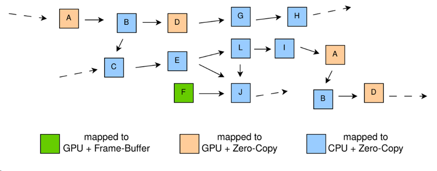
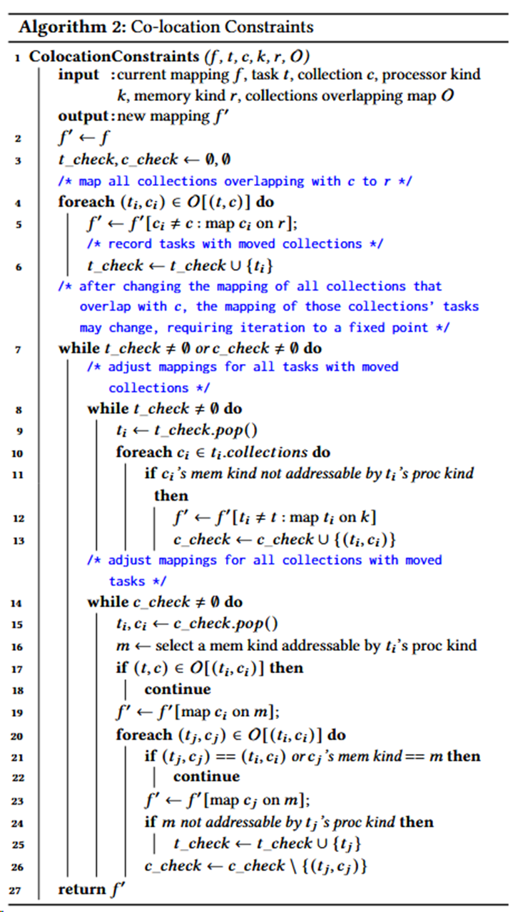

# [Automated Mapping of Task-Based Programs onto Distributed and Heterogeneous Machines](https://dl.acm.org/doi/10.1145/3581784.3607079)

## 问题：

上图显示了三种内存：只能由CPU寻址的系统内存（每个插槽一个），只能由GPU寻址的帧缓冲区内存和两者均可寻址的零拷贝内存。假如一个GPU计算t1需要访问放置在零拷贝内存中的数据c，那么它通常会运行得更慢。因为访问零拷贝内存和帧缓冲区内存相比延迟会更大，带宽也会减小。但是，如果后续要访问c的计算t2是在CPU或者另外一个GPU上，那么直接将c放置在零拷贝内存中可能比先将c放置在t1的帧缓冲区内存中然后复制更新到t2可寻址到的内存更快。同样的，假如另一个和计算t1并发执行在同一个GPU的计算t3打算访问放置在帧缓冲区内存中的数据时，帧缓冲区内存可能不足够再存储一次数据c。要为c选择最快的内存分配，必须知道每个映射选择的成本。这样的映射决策组合在实际应用程序中是指数级的。由于应用程序组件之间的依赖性、通信链路的速度不同以及硬件资源的容量限制，此类映射决策的组合变得很复杂。

到目前为止，解决映射问题的最常见方法是在运行时系统中使用贪婪的启发式方法。比如，如果存在GPU，则始终将任务映射到GPU上，且始终将任务参数映射到最近的具有足够容量的处理器内存中。这种启发式方法并不能使所有应用都实现高性能，因此一些系统为程序员提供了影响映射的机制，并且至少有一个系统提供了允许应用程序控制映射决策的完整接口[6]。手写的映射可以使用应用程序和目标机器的知识，从而实现比系统选择的启发式映射有着更高的性能。然而，手写映射需要对应用程序和目标机器有着深入的了解，根据经验，复杂应用程序的手写映射可能需要一天到几天的时间。

AutoMap的核心是一种新的搜索算法，称为约束坐标下降法或CCD。CCD交替进行于优化任务映射和数据映射之间，其根据最大化运行速度来权衡任务的映射和根据最小化通信来权衡数据的映射。AutoMap为了确保搜索了解执行任务和复制数据的实际成本，其选择动态分析方法而不是依赖静态估计。各个映射在每次运行时的性能可能会有显著差异，因此为了获得性能均值和方差的可靠估计，需要执行多次任务。

## 相关背景

#### 基于任务编程

机器$M$建模为图，其中节点是处理器和存储器。每个处理器都为一种类型（本文中为CPU或GPU），每个内存都为一种类型且拥有以字节为单位的容量。边有两种类型：处理器  和内存  之间的边表示  可由  寻址，两个内存之间的边表示两个内存之间存在通信通道。

基于任务的系统是使用加速器进行分布式编程的常见编程模型。在科学计算中，基于任务的系统包括PaRSEC、StarPU、Legion、最新版本的OpenMP、OmpSs、COMPSs和 PyCOMPSs；在数据分析中，广泛使用的基于任务的编程模型包括 Spark[41]、TensorFlow[1]、PyTorch[27]、Dask[11]和Ray[23]。

映射f为(任务,集合)->(处理器,存储器)

需要符合两种条件：

* 存储器可以被处理器所访问
* 任务是可以在处理器上处理的类型

#### 相关工作

**异构系统的任务调度。**HEFT[38]、MCT[22]和FCP[33]算法等最早针对异构集群任务调度的工作主要在处理器上调度任务t，它们将处理器速度、任务  的成本和清除每个处理器当前任务队列所需时间列入考虑范围。这类启发式方法假设数据存放的单个存储器可以分配给运行其任务的处理器。正如本文已经指出的，当存在多个存储器时，映射选择不仅会影响任务  的时间，还会影响使用其数据的后续任务的成本。

**基于机器学习的映射策略。**先前的工作将多核代码转换为OpenCL，并使用决策树分类器（从基于静态编译器分析的训练数据中学习）来估计应用程序在 GPU 上运行是否有利可图[25]。Wang等人提出了在两种多核平台上的、包含线程数量和调度策略的、数据敏感的和数据不敏感的机器学习预测器[39]。在文献中，相同的处理器被选择于基准测试中[25]。但这些论文没有考虑数据的内存选择和分布式机器条件。AutoMap根据每个任务和数据进行决策，可以找到更快的映射方法。

**通信感知流程图。**另外，有一类先前的工作根据最大化减少MPI进程之间的通信，优化了集群上MPI进程到计算核心的映射。例子包括基于搜索的策略和配置文件引导的策略[9]。这些工作使用有关节点之间通信的信息，根据节点之间的通信来找到最佳的处理器布局。在这些方法中，计算和数据是统一的，且总是被放在一起。因此，这个问题比本文考虑的问题更简单，本文会考虑将数据放入哪个内存也会影响性能。

**自动性能优化。**多种领域特定语言在可能的性能优化空间中，实现了类似于高级源程序和低级实现规范的分离（例如用于图像处理的Halide[29]、用于图形应用的Graphlt[42]、用户稀疏张量代数的TACO[20]）。这种分离提供了一个用于自动优化的接口：OpenTuner，一个基于搜索算法集合的程序自动调整的可扩展框架。该接口已被用于为Halide和GraphIt寻找高性能的调度策略。这些系统中考虑的优化是更高级别的数据结构布局和并行化转换[24][29][36]。这些系统解决的是与映射不同的优化问题。

FlexFlow是一种深度学习引擎，可以自动寻找深度神经网络（DNN）的快速并行化策略[19]。和上面的问题一样，FlexFlow的优化与映射不同：它使用固定的映射策略搜索数据并计算 DNN 的分区策略（在 GPU 上执行所有任务并将所有数据存储在帧缓冲区中）。此搜索依赖于任务图成本估计器，它与 AutoMap 一样，通过分析估计执行时间。与 AutoMap 不同，它使用静态带宽来进行估计。采用固定的映射，并使用 DNN 计算图而不是较低级别的任务图。

**动态负载均衡。**已经开发了很多使用动态负载均衡的工作[5][7][34]。负载均衡算法考虑的机器和任务和AutoMap相比一般会更加统一，并且不需要对任务依赖、内存约束和通信时间进行建模。

**自动化和特定领域的映射。**先前相关的工作使用静态分析将任务分配给异构机器上的处理器[28]或将数据分配给软件管理的内存层级结构[32]。Sbirlea等人将编译时分析与动态工作窃取相结合，将数据流编程模型映射到异构平台上[35]。AutoMap是已知的第一个解决同时映射任务和数据集合的一般问题的工作。

其他工作使用领域内特定的信息来为领域中不同应用程序给出映射策略。Lux是一个用于图形处理的分布式多GPU系统，它使用带有动态负载的手写映射器[17]。ROC是一种用于快速图神经网络（GNN）训练和推理的分布式多GPU系统。它实现了动态图分区[18]。其所选择的GNN分区策略和内存管理策略意味着这是领域特定的应用映射策略。相比之下，AutoMap不做出特定领域的假设，而是针对大量迭代程序。

**配置文件引导优化。**配置文件引导优化使用运行时收集的分析数据来告知生产运行中使用的优化决策[10]。AutoMap使用任务执行和数据移动成本的配置文件。检查器-执行器框架使用动态分析（检查器）来捕获有关目标程序的信息，然后 在进行运行时优化时（执行器）使用此信息来优化程序组件[30][31]。虽然在本文中没有考虑这一点，但原则上AutoMap可以像检查器-执行器框架一样使用。AutoMap在初始化时在线运行，然后可以为该执行的剩余部分选择快速映射。

## 实现

#### 前提概要

首先！

1. 采用组任务
2. 拓展了搜索空间，考虑是否分布式运行

整体架构：

* driver确定处理器和存储器的类型
* mapper来进行具体的映射

#### 搜索算法

* 约束条件
  * 任务的数据被映射到任务的处理器可寻址的内存中
  * 如果在C中两个数据存在边，那么这两个数据都会映射到同一个内存类型中
* C是由G导出的图
  * 每一个点c代表一个数据集合
  * 两个点之间存在边则代表两个数据有重叠的部分
  * 边的权值代表两个数据集合的重叠部分大小
* O是集合重叠的一个映射
* 根据任务运行时时间排序t
  * 一种直观获取高性能的映射方案的方法
  * 先放运行时间长的任务
* 得出一次新的映射移除1/（n-1）权值最小的边
  * 初始的限制简化了搜索空间
  * 一步步放松了对数据移动的约束

* 约束条件
  * 任务的数据被映射到任务的处理器可寻址的内存中
  * 如果在C中两个数据存在边，那么这两个数据都会映射到同一个内存类型中
* OptimizeTask
  * 采用坐标下降法获得一个最快的映射f和其性能p
* Co-location Constrains
  * 保证了满足约束条件
  * 具体方法：迭代运行以下两种判断
    1. 如果f'因为任务t不能访问集合参数c违反约束1，则将t移动到能够访问内存类c的处理器类。
    2. 如果f'因为数据集合c被移动到内存类k，且(c,c')∈E，c'却被映射到不同的内存类别中而违反约束2，那么c'也被移动到该内存类别k中 	

## 结果

找到不常见的映射！性能优于自动映射器，基本相当于甚至优于专家自定义的手写映射器。