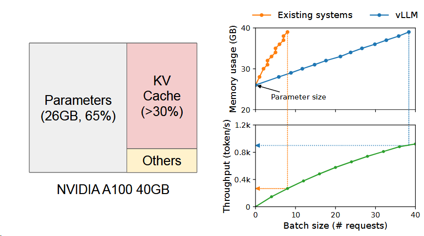
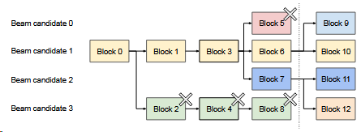
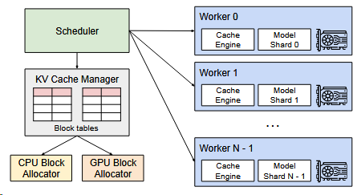

# [Efficient Memory Management for Large Language Model Serving with PagedAttention](https://arxiv.org/abs/2309.06180)

## 预备知识

### transformer的self-attention layers

> For an input hidden state sequence $(𝑥1, . . . , 𝑥𝑛) ∈ R^{𝑛×𝑑}$ , a self-attention layer first applies linear transformations on each position 𝑖 to get the query, key, and value vectors:
>
> 
>
> Then, the self-attention layer computes the attention score $𝑎_{𝑖 𝑗}$ by multiplying the query vector at one position with all the key vectors before it and compute the output $𝑜_𝑖$ as the weighted average over the value vectors:
>
> 

简而言之，先把每个位置的词算出其q k v，然后用注意力公式算出每两个词之间的a和每个词的o。

除此之外，transformer including the embedding layer, feed-forward layer, layer normalization, residual connection, output logit computation, and the query, key, and value transformation.

### KV Cache

> 以GPT为代表的Decoder-Only自回归语言模型在生成每一个新的 token 时，接受所有之前生成的 tokens 作为输入。然而，对于这些先前生成的 tokens，每次生成新的 token 时都需要重新计算他们的表示，这个过程造成了大量的计算浪费。KV Cache 的引入就是为了解决这个问题。
>
> KV Cache实质上是存储了之前计算过的 key-value 对用于下一个Token的生成。在 Transformer 结构中，self-attention 中的k_proj, v_proj会将输入的每个 token 转化为一个 key 和一个 value，然后使用这些 key-value 以及当前的query对来计算下一个 token。引入 KV Cache，我们就可以将之前生成的 tokens 对应的 key-value 对存储起来，当生成新的 token 时，**直接从 KV Cache 中取出这些已经计算好的 key-value 对，再把当前token的key-value做一个连结在进行计算**，这样就避免了KV的重复计算，大大提高了计算效率。

KV Cache包含以下步骤

> **预填充阶段**：在计算第一个输出token过程中，此时Cache是空的，计算时需要为每个 transformer layer 计算并保存key cache和value cache，在输出token时Cache完成填充；FLOPs同KV Cache关闭一致，存在大量gemm操作，推理速度慢，这时属于Compute-bound类型计算。
>
> **KV Cache阶段**：在计算第二个输出token至最后一个token过程中，此时Cache是有值的，每轮推理只需读取Cache，同时将当前轮计算出的新的Key、Value追加写入至Cache；FLOPs降低，gemm变为gemv操作，推理速度相对第一阶段变快，这时属于Memory-bound类型计算。

> 无KV Cache生成示例
>
> 

> KV Cache生成示例
>
> 

我们可以看到，使用了KV Cache节省了大量的重复计算。

### 当前Batching Techniques for LLMs

困境：

* 请求可能在不同时间段到达
* 请求序列的长度不同

目前方法：

* 采用细粒度的批处理机制

### Memory Challenges in LLM Serving

挑战：

* KV cache太大了，且GPU的计算能力会比其内存增长得更快。
* decoding算法越来越复杂，如何适配。
* 输入输出长度不同的情况下如何调度资源。

## vLLM

### 效果

**效果**：

>  PagedAttention, an attention algorithm inspired by the classical **virtual memory** and **paging techniques** in operating systems

想法来源于虚拟内存和分页技术

> vLLM, an LLM serving system that achieves (1) **near-zero waste** in KV cache memory and (2) **flexible sharing of KV cache** within and across requests to further reduce memory usage.

> 

左图就是vLLM将KV Cache控制在红色，且用一部分黄色进行激活。所以随着规模扩大，vLLM的内存使用量可以控制得更好。正如右图所示。

> 

内存资源浪费平均百分比图，可以看到vLLM的有效性。

### PagedAttention

**特色：**允许不连续的KV cache存储方式。方法是采用分块的方式。

> 

当原文为 Alan Turing is a|computer scientist and mathmatician|renowned for ...

其被分成三个块来完成，这三个块的物理内存不一样。

计算方式为

> 

这样就可以减少KV Cache的浪费，最多浪费3个空。（这也是为什么操作系统引入分页机制）

> 

并且根据操作系统的**写时共享机制**，PagedAttention 可以当产生多个结果时，将下图中的intelligence is复制到多个块上。

> 

还采用了**束搜索机制**

> 
>
> 这是一个束宽为2的[束搜索样例](https://zh.d2l.ai/chapter_recurrent-modern/beam-search.html)。选择最大的两个。
>
> 
>
> 在vLLM中，则是这种效果，跟上图非常相似。

vLLM也考虑到**共享前缀**的问题。

> 

对于此类应用vLLM会共享前缀，只在Task Input上有差异。其实就是前文的分页机制。

### Scheduling and Preemption

采用**first-come-first-serve** (**FCFS**)，先来先服务。

问题：

* 假如满了，应该驱逐哪些块
  * transformer特性→同一个序列的块要么一起被驱逐，要么一起留下。
  * 假如有束搜索，其将序列分成了很多组，且存在内存共享，组内所有序列的块同时被调度。
* 假如仍被需要，如何恢复被驱逐的块。
  * 交换。放到CPU内存中。
  * 重新计算。因为解码时的令牌和用户提示链接起来成为新的提示，一次就可以生成KV Cache，所以会比之前算的块。

### Distributed Execution

> Specifically, the attention operator is split on the attention head dimension, each SPMD process takes care of a subset of attention heads in multi-head attention.

VLLM是将注意力算子在注意力头维度上进行分割。

且由于每个模型的分片处理相同的输入标记集，所以vLLM采用的是集中式调度，一个Scheduler。

> This common mapping allows GPU workers to execute the model with the physical blocks provided by the scheduler for each input request. Although each GPU worker has the same physical block IDs, **a worker only stores a portion of the KV cache for its corresponding attention heads.**

由于头不同，管理起来是一样的，但是数据是不一样的。

> 
>
> 1. In each step, the scheduler first prepares the message with input token IDs for each request in the batch, as well as the block table for each request. 
>
> 2. Next, the scheduler broadcasts this control message to the GPU workers. 
> 3. Then, the GPU workers start to execute the model with the input token IDs. 
> 4. In the attention layers, the GPU workers read the KV cache according to the block table in the control message. 
> 5. During execution, the GPU workers synchronize the intermediate results with the all-reduce communication primitive without the coordination of the scheduler, as in [47]. 
> 6. In the end, the GPU workers send the sampled tokens of this iteration back to the scheduler. 