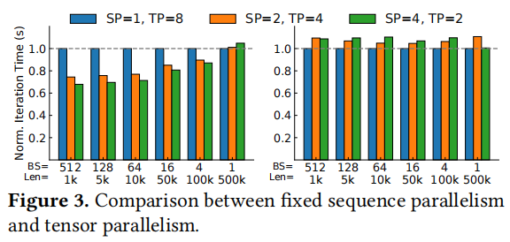

# [LoongServe: Efficiently Serving Long-Context Large Language Models with Elastic Sequence Parallelism](https://arxiv.org/abs/2404.09526)
> Bingyang Wu, Shengyu Liu, Yinmin Zhong, Peng Sun, Xuanzhe Liu, Xin Jin
>
> PKU Xin Jin导师和Shanghai AI Lab Peng Sun导师的论文
>
> [LoongServe/LoongServe](https://github.com/LoongServe/LoongServe)

## 一句话总结概括

针对静态的并行策略无法解决不同文本长度的请求分配问题

## 该洞见引申到其他领域中的可能

## 创新点或贡献

- computation efficiency
  - 实时弹性地调整parallelism(ESP)
- communication efficiency
  - reduce KV cache migration overhead
  - overlap communication with computation
- GPU memory efficiency
  - reduce kv cache fragmentation across instances

## 具体设计

- ESP：在Scale-up和Scale-down的场景中没有额外通信开销
  - Prefill phase
    - *proactive scaling-down* mechanism
      - scale down重用prefill 阶段的通信开销
  - Decoding Phase
    - *multi-master decoding* mechanism
      - 避免了existing kv caches的migration
      - overlap the communication with computation
- Manage tokens at the granularity of a single token across instances without any locality
  - 消除了内存碎片？
- Scalable four-step scheduling algorithm
  - DoP setting, batching, key-value cache placement, elastic scaling

## 实验评估

## 背景

### 先前工作存在的问题概述

- 设置是静态的，但workloads是动态的
  - existing practices decide the parallel configuration statically before launching the service
  - The variance of input lengths of requests becomes larger
- 静态并行也没有考虑请求不同阶段(prefill decode)的差异

### 难点

fully unleashing the potential of ESP

- A large overhead of elastic scaling can negate the benefit of flexible resource allocation
- The complicated scheduling space: 
  - dynamic loads of requests
  - variable sequence lengths
  - different phases

### 补充背景

**Sequence Parallelism** and **Striped Attention**

\

1. tokens被分成几段到不同的instances中
2. 计算自己的q和当前要处理的kv（一开始是自己）
3. 传kv到下一个相邻的instance
4. 回到第二步，直到做完所有attention计算

好处：

- 序列并行兼容流行的注意力机制
- 和张量并行有相同的计算复杂度，但消耗更少的GPU内存
- 可以和张量并行一起使用

缺点：

- 只支持prefill阶段
- 需要在并行度固定的训练场景中才能使用

---

**Computation and GPU memory consumption across requests with different input lengths**

图的含义（应该是）

- 左边是prefill，右边是decode

- 上面是短文本，下面是长文本

- 横坐标是TP规模，纵坐标是范数

观察：

- 长文本需要的内存相比短文本是线性增长的
- **prefill在并行的收益更大，但decode在并行时收益并不大**

---

**Dynamically altering the parallelism strategy**

- 需要重新启动，开销很大，比如需要几分钟，不可接受
- 内存碎片问题

局部性需要kvcache尽量在同一个节点，所以来了六个KV cache，但没有cache engine可以存放了

---

弹性序列并行

不同文本情况下，并行策略带来的收益也不一样

## Q&A

