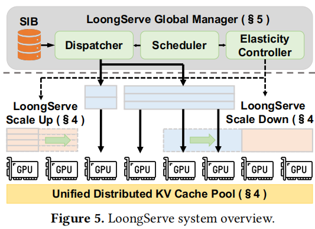
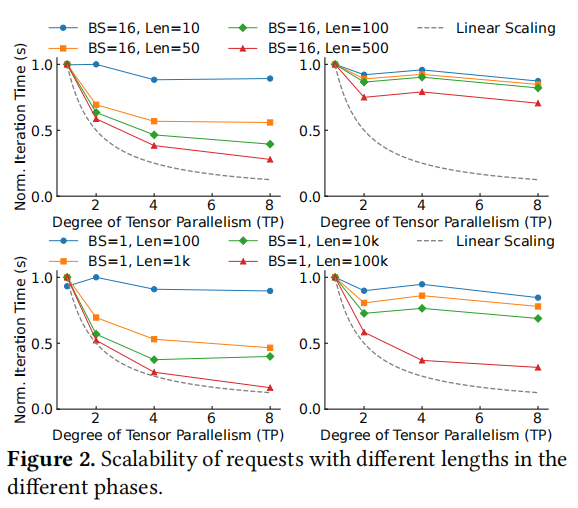

# [LoongServe: Efficiently Serving Long-Context Large Language Models with Elastic Sequence Parallelism](https://arxiv.org/abs/2404.09526)
> Bingyang Wu, Shengyu Liu, Yinmin Zhong, Peng Sun, Xuanzhe Liu, Xin Jin
>
> PKU Xin Jin导师和Shanghai AI Lab Peng Sun导师的论文
>
> [LoongServe/LoongServe](https://github.com/LoongServe/LoongServe)

## 一句话总结概括

针对静态的并行策略无法解决不同文本长度的请求分配问题

## 该洞见引申到其他领域中的可能

## 创新点或贡献

- computation efficiency
  - 实时弹性地调整parallelism(ESP)
- communication efficiency
  - reduce KV cache migration overhead
  - overlap communication with computation
- GPU memory efficiency
  - reduce kv cache fragmentation across instances

## 具体设计

- ESP：在Scale-up和Scale-down的场景中没有额外通信开销
  - Prefill phase
    - *proactive scaling-down* mechanism
      - scale down重用prefill 阶段的通信开销
  - Decoding Phase
    - *multi-master decoding* mechanism
      - 避免了existing kv caches的migration
      - overlap the communication with computation
- Manage tokens at the granularity of a single token across instances without any locality
  - 消除了内存碎片？
- Scalable four-step scheduling algorithm
  - DoP setting, batching, key-value cache placement, elastic scaling

---

**ESP的例子**

- 选择scale down
  - 在prefill完长文本后，decode需要的资源不再那么多【B1，I1】【B2，I1】
  - 需要分配一些资源给新的prefill【B2，I3】
- 选择scale up
  - decode阶段生成的tokens超过了KV cache的空间【B1，I3】【B2，I2】
  - batch size很大的时候，会变成compute bound

---

**Scale down**的时候会面临一个挑战：旧的并行组的KV tensors如何有效地传输到新的并行组

以往的解决方案：在prefill后将KV tensors传到对应的并行组。但这种方案有两个问题。（1）在句子长度很长的时候，需要长达几秒钟的传输时间需要几秒钟，甚至比decoding阶段还要长。（2）在多个instances节点都有足够空间的情况下才可以使用，比如需要600空间的请求进入100，200，400三个节点中，因为第一个节点没有600/3=200的空间，所以无法服务。那么，我们需要使用不规则的GPU空间来存放KV tensors？

总的来说，有两个难题：1. 如何减少通信。2.如何实现不规则

文章提出了一个insight：**在使用PP的prefill阶段中，并行组会循环KV tensors的信息**。我们就可以利用这个特性选择性保存我们需要的KV tensors，从而实现零额外开销的弹性缩小。

---

**Scale up**的时候会面临一个主要挑战：确保新添加的实例能够有效参与，并且不会增加额外的开销

以往的解决方案：很多工作只支持在单个instance中分布式推理。但当其内存不足时，会将一部分批处理请求迁移到另外一个实例中，这部分开销很大。并且这种方法要求所有或大部分KV tensors都得存在一个instance中，可能会导致内存碎片问题。

总的来说，有两个难题：1.Cache整体迁移耗时长。 2.KV cache的碎片化问题导致无法服务。

所以文章提出了一种方法，将sequence parallelism推广到decode阶段。每个Req有其主要负责的master，而KV cache可以存在在不同节点中。比如Instance 1负责r1和r2两条req。其部分KV Cache存放在Instance2中。所以每次计算其在本地算完req的kv和q后，kv存放用于本地kv cache，并进行这部分kv的attention计算。将一部分q分到instance2中，然后instance2算完再发回来，然后在master instance完成剩下的线性层。

> 感觉这里假如不均匀放的话，会涉及GPU忙等问题，比如r1可能只在一个节点，r2却在两个节点中。

---

**调度**

1. **Dispatching**

   考虑GPU内存和GPU计算压力的情况下，将一部分请求从pending queue分发到prefill queue，这部分请求就是$R_p$。
   
   关于GPU memory的限制，假如该请求可能触发驱逐（用户给出的最大生成长度），那么这个请求将无法进入。
   
   关于GPU computing的限制。这个有一个观测，LLM inference会在某个边界后从memory bound转化为computing bound。在memory bound的时候，增加更多的请求可以提高GPU计算的效率。在computing bound的时候，增加更多的请求基本只是延长执行的时间。所以本工作就在超过这一界限的时候，停止请求的分发。并且这里还得评估最坏情况中抢占之前请求的成本和该请求prefill获取的性能收益。
   
> 这里的公式没看懂
   
2. **Elastic Instance Allocation**

   具体分发prefill的请求，意思是将选出来的$R_p$分发给哪些弹性节点$E_p$。

   这里会涉及最大化性能的考虑。这里可能会涉及prefill对decode的抢占。

   先将空闲的instance分发给Rp，如果空闲的kv cache空间不够，优先使用kv cache剩余空间更多的节点。

   且为了避免抢占，需要尽可能将抢占实例中的kv cache迁移到别的实例中。
   
   > 公式也没看懂。
   
3. **Batching**

   根据$R_p$和$E_p$决定DoP。

4. **Elastic Scaling Plan Generation**

   动态地生成ESP组的scale up和scale down。

## 实验评估

实验评估真硬啊。。。

## 背景

### 先前工作存在的问题概述

- 设置是静态的，但workloads是动态的
  - existing practices decide the parallel configuration statically before launching the service
  - The variance of input lengths of requests becomes larger
- 静态并行也没有考虑请求不同阶段(prefill decode)的差异

### 难点

fully unleashing the potential of ESP

- A large overhead of elastic scaling can negate the benefit of flexible resource allocation

- The complicated scheduling space: 
  - dynamic loads of requests
  - variable sequence lengths
  - different phases

### 补充背景

**Sequence Parallelism** and **Striped Attention**

\

1. tokens被分成几段到不同的instances中
2. 计算自己的q和当前要处理的kv（一开始是自己）
3. 传kv到下一个相邻的instance
4. 回到第二步，直到做完所有attention计算

好处：

- 序列并行兼容流行的注意力机制
- 和张量并行有相同的计算复杂度，但消耗更少的GPU内存
- 可以和张量并行一起使用

缺点：

- 只支持prefill阶段
- 需要在并行度固定的训练场景中才能使用

---

**Computation and GPU memory consumption across requests with different input lengths**

图的含义（应该是）

- 左边是prefill，右边是decode

- 上面是短文本，下面是长文本

- 横坐标是TP规模，纵坐标是范数

观察：

- 长文本需要的内存相比短文本是线性增长的
- **prefill在并行的收益更大，但decode在并行时收益并不大**

---

**Dynamically altering the parallelism strategy**

- 需要重新启动，开销很大，比如需要几分钟，不可接受
- 内存碎片问题

局部性需要kvcache尽量在同一个节点，所以来了六个KV cache，但没有cache engine可以存放了

---

**弹性序列并行**

不同文本情况下，并行策略带来的收益也不一样

## 思考角度

### 我如何做这个问题

### 这个洞见可以引申出其他其他方法吗

异构集群下处理弹性调度问题是否会有什么难题

### 该洞见是否可以迁移到其他领域中

### 该工作有什么可能可以改进的地方

1. 是否只针对同构系统
2. 这个和prefill decode静态的分离区别在哪

## Q&A

scale down的缓冲区是什么？在4.1末尾