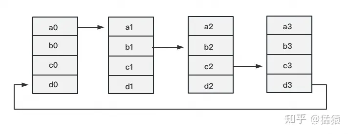
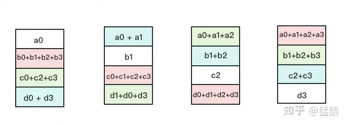
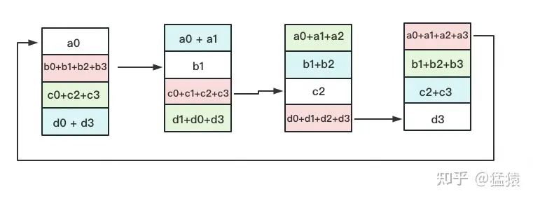
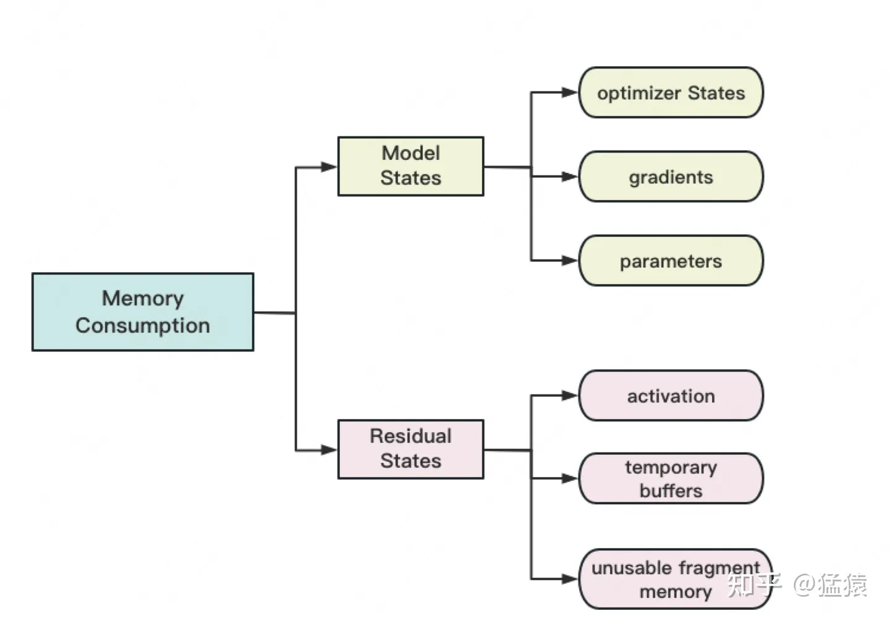
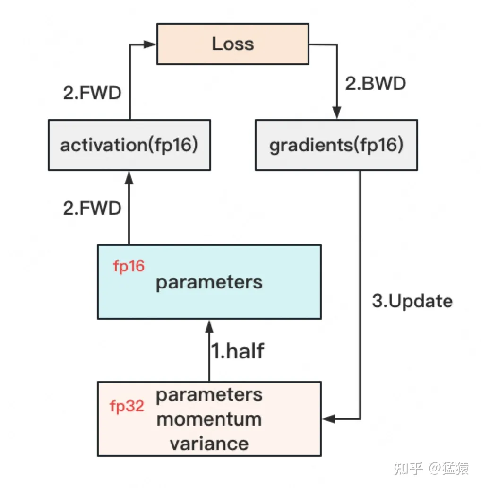
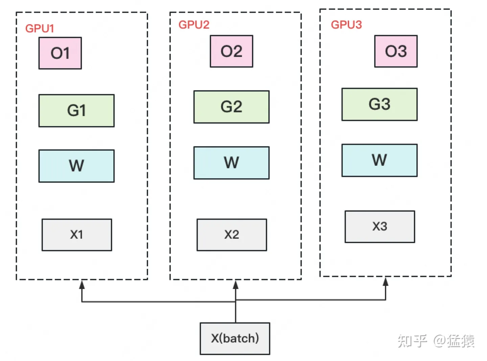
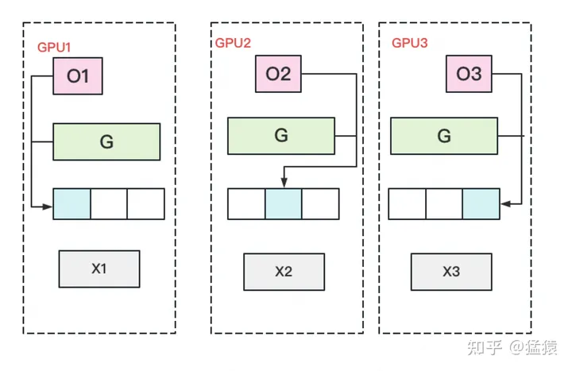
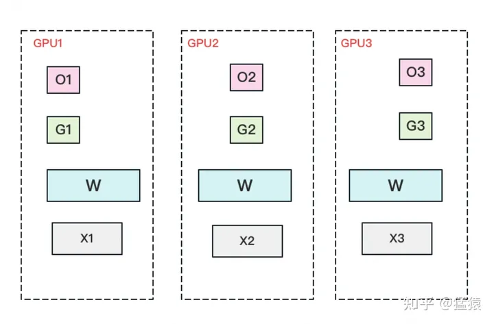
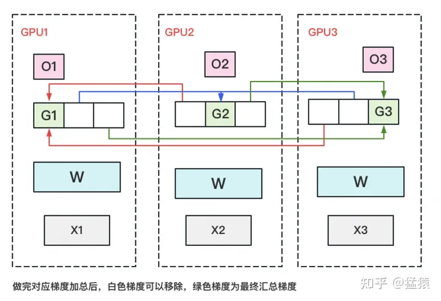
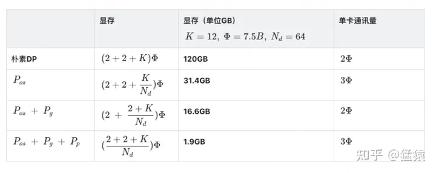

# 【学习笔记】大模型训练：数据并行

[原文链接](https://zhuanlan.zhihu.com/p/617133971)

> 数据并行的核心思想是：在各个GPU上都**拷贝一份完整模型**，各自吃一份数据，算一份梯度，最后对梯度进行**累加**来更新整体模型。

三种主流数据并行的实现模式：

> - **DP（Data Parallelism）**：最早的数据并行模式，一般采用参数服务器(Parameters Server)这一编程框架。实际中多用于单机多卡
> - **DDP（Distributed Data Parallelism）**：分布式数据并行，采用Ring AllReduce的通讯方式，实际中多用于多机场景
> - **ZeRO：**零冗余优化器。由微软推出并应用于其DeepSpeed框架中。严格来讲ZeRO采用数据并行+张量并行的方式，旨在降低存储。

## DP并行

> - 若干块**计算GPU**，如图中GPU0~GPU2；1块**梯度收集GPU**，如图中AllReduce操作所在GPU。
> - 在每块计算GPU上都拷贝一份完整的模型参数。
> - 把一份数据X（例如一个batch）均匀分给不同的计算GPU。
> - 每块计算GPU做一轮FWD和BWD后，算得一份梯度G。
> - 每块计算GPU将自己的梯度**push**给梯度收集GPU，做聚合操作。这里的聚合操作一般指**梯度累加**。当然也支持用户自定义。
> - 梯度收集GPU聚合完毕后，计算GPU从它那**pull**下完整的梯度结果，用于更新模型参数W。更新完毕后，计算GPU上的模型参数依然保持一致。
> - **聚合再下发梯度的操作，称为AllReduce**。

该方法会面临以下问题：

* **存储开销大**。每块GPU上都存了一份完整的模型，造成冗余。
* **通讯开销大**。Server需要和每一个Worker进行梯度传输。当Server和Worker不在一台机器上时，Server的带宽将会成为整个系统的计算效率瓶颈。

为此，相关工作提出了**梯度异步更新**方法。

> - 在第10轮计算中，该Worker正常计算梯度，并向Server发送push&pull梯度请求。
> - 但是，该Worker并不会实际等到把聚合梯度拿回来，更新完参数W后再做计算。而是直接拿旧的W，吃新的数据，继续第11轮的计算。**这样就保证在通讯的时间里，Worker也在马不停蹄做计算，提升计算通讯比。**
> - 当然，异步也不能太过份。只计算梯度，不更新权重，那模型就无法收敛。图中刻画的是**延迟为1**的异步更新，也就是在开始第12轮对的计算时，必须保证W已经用第10、11轮的梯度做完2次更新了。

可选择的延迟情况：

> - **(a) 无延迟**
> - **(b) 延迟但不指定延迟步数**。也即在迭代2时，用的可能是老权重，也可能是新权重，听天由命。
> - **(c) 延迟且指定延迟步数为1**。例如做迭代3时，可以不拿回迭代2的梯度，但必须保证迭代0、1的梯度都已拿回且用于参数更新。

很香，但会减慢模型整体收敛速度。

## DDP（分布式数据并行）

> **DDP首先要解决的就是通讯问题：将Server上的通讯压力均衡转到各个Worker上。实现这一点后，可以进一步去Server，留Worker。**

> **目前最通用的AllReduce方法：Ring-AllReduce**。它由百度最先提出，非常有效地解决了数据并行中通讯负载不均的问题，使得DDP得以实现。

### Ring-AllReduce

> 假设有4块GPU，每块GPU上的数据也对应被切成4份。AllReduce的最终目标，就是让每块GPU上的数据都变成箭头右边汇总的样子。
>
> 

分为两大步骤：**Reduce-Scatter**和**All-Gather。**

* **Reduce-Scatter**

  > 
  >
  > 定义网络拓扑关系，使得每个GPU只和其相邻的两块GPU通讯。每次发送对应位置的数据进行**累加**。每一次累加更新都形成一个拓扑环，因此被称为Ring。
  >
  > 
  >
  > 一次累加完毕后，蓝色位置的数据块被更新，被更新的数据块将成为下一次更新的起点，继续做累加操作。
  >
  > 
  >
  > **3次**更新之后，每块GPU上都有一块数据拥有了对应位置完整的聚合（图中红色）。此时，Reduce-Scatter阶段结束。进入All-Gather阶段。目标是把红色块的数据广播到其余GPU对应的位置上。

* **All-Gather**

  > 依然按照“相邻GPU对应位置进行通讯”的原则，但对应位置数据不再做相加，而是直接替换。All-Gather以红色块作为起点。
  >
  > 
  >
  > 以此类推，同样经过**3轮迭代后**，使得每块GPU上都汇总到了完整的数据。

这个方法能实现总通讯量相同，但负载会更均衡，太绝了！！！！

除此之外，也有参数服务器的方法，但没有细看，感兴趣可以再看原文。

## 零冗余优化DeepSpeed ZeRO

[原文链接](https://zhuanlan.zhihu.com/p/618865052)

DP的缺点还有一个**显存开销问题**没有解决，**ZeRO的思想就是用通讯换显存**。

### 存储消耗分析

#### 存储分类

> **Model States**指和模型本身息息相关的，必须存储的内容，具体包括：
>
> - **optimizer states**：Adam优化算法中的momentum和variance
> - **gradients**：模型梯度
> - **parameters**：模型参数W
>
> **Residual States**指并非模型必须的，但在训练过程中会额外产生的内容，具体包括：
>
> - **activation**：激活值。在流水线并行中我们曾详细介绍过。在backward过程中使用链式法则计算梯度时会用到。有了它算梯度会更快，但它不是必须存储的，因为可以通过重新做Forward来算它。
> - **temporary buffers:** 临时存储。例如把梯度发送到某块GPU上做加总聚合时产生的存储。
> - **unusable fragment memory**：碎片化的存储空间。虽然总存储空间是够的，但是如果取不到连续的存储空间，相关的请求也会被fail掉。对这类空间浪费可以通过内存整理来解决。

#### 精度混合训练

> 对于模型，我们肯定希望其参数越精准越好，也即我们用**fp32（单精度浮点数，存储占4byte）**来表示参数W。但是在forward和backward的过程中，fp32的计算开销也是庞大的。
>
> 那么能否在计算的过程中，引入**fp16或bf16（半精度浮点数，存储占2byte）**，来减轻计算压力呢？于是，混合精度训练就产生了，它的步骤如下图：
>
> 
>
> - 存储一份fp32的parameter，momentum和variance（统称model states）
> - 在forward开始之前，额外开辟一块存储空间，将fp32 parameter减半到fp16 parameter。
> - 正常做forward和backward，在此之间产生的activation和gradients，都用fp16进行存储。
> - 用fp16 gradients去更新fp32下的model states。
> - 当模型收敛后，fp32的parameter就是最终的参数输出。

#### 存储大小

> 现在，我们可以来计算模型在训练时需要的存储大小了，假设模型的参数W大小是 $Φ$ ，**以byte为单位**，存储如下：
>
> 
>
> 因为采用了Adam优化，所以才会出现momentum和variance，当然你也可以选择别的优化办法。因此这里为了更通用些，记模型必存的数据大小为 $KΦ$ 。因此最终内存开销为： $2Φ+2Φ+KΦ$
>
> 另外，**这里暂不将activation纳入统计范围**，原因是：
>
> - activation不仅与模型参数相关，还与batch size相关
> - activation的存储不是必须的。存储activation只是为了在用链式法则做backward的过程中，计算梯度更快一些。但你永远可以通过只保留最初的输入X，重新做forward来得到每一层的activation（虽然实际中并不会这么极端）。
> - 因为activation的这种灵活性，纳入它后不方便衡量系统性能随模型增大的真实变动情况。因此在这里不考虑它，在后面会单开一块说明对activation的优化。

### ZeRO-DP

> ZeRO用了一个简单粗暴的办法：**如果数据算完即废，等需要的时候，我再想办法从个什么地方拿回来，那不就省了一笔存储空间吗？**

#### $P_{os}$：优化状态分割

> 首先，从 optimizer state开始优化。将optimizer state分成若干份，每块GPU上各自维护一份。这样就减少了相当一部分的显存开销。如下图：
>
> 
>
> 此时参数W=fp16，梯度G=fp16，O=fp32。此时，整体数据并行的流程如下：
>
> （1）每块GPU上存一份完整的参数W。将一个batch的数据分成3份，每块GPU各吃一份，做完一轮foward和backward后，各得一份梯度。
>
> （2）对梯度做一次**AllReduce**，**得到完整的梯度G**，产生单卡通讯量 $2Φ$ 。**为了表达简明，这里通讯量我们就不再换算成byte了**，而直接根据参数量来计算。**AllReduce（reduce-scatter + all-gather）**在上文中有提及。
>
>
> （3）得到完整梯度G，就可以对W做更新。我们知道W的更新由optimizer states和梯度共同决定。**由于每块GPU上只保管部分optimizer states，因此只能将相应的W（蓝色部分）进行更新**。（2）和（3）可以用下图表示：
>
> 
>
> （4）此时，每块GPU上都有部分W没有完成更新（图中白色部分）。所以我们需要对W做一次**All-Gather**，从别的GPU上把更新好的部分W取回来。产生单卡通讯量$ Φ$ 。

#### $P_{os}+P_g$ ：优化状态与梯度分割

> 更进一步，把GPU格子也拆开
>
> 
>
> 此时，数据并行的整体流程如下：
> （1）每块GPU上存一份完整的参数W。将一个batch的数据分成3份，每块GPU各吃一份，做完一轮foward和backward后，**算得一份完整的梯度（下图中绿色+白色）**。
> （2）对梯度做一次**Reduce-Scatter**，保证每个GPU上所维持的那块梯度是聚合梯度。例如对GPU1，它负责维护G1，因此其他的GPU只需要把G1对应位置的梯度发给GPU1做加总就可。汇总完毕后，白色块对GPU无用，可以从显存中移除。单卡通讯量 Φ 。（1）和（2）见下图：
>
> 
>
> （3）每块GPU用自己对应的O和G去更新相应的W。更新完毕后，**每块GPU维持了一块更新完毕的W**。同理，对W做一次**All-Gather**，将别的GPU算好的W同步到自己这来。单卡通讯量 $Φ$ 。

#### $P_{os}+P_g+P_p$：优化状态、梯度与参数分割

> 更进一步
>
> 把参数也切开。每块GPU置维持对应的optimizer states，gradients和parameters（即W）。
>
> 
>
> 数据并行的流程如下：
> （1）每块GPU上只保存部分参数W。将一个batch的数据分成3份，每块GPU各吃一份。
> （2）做forward时，对W做一次**All-Gather**，取回分布在别的GPU上的W，得到一份完整的W，单卡通讯量 $Φ $**。forward做完，立刻把不是自己维护的W抛弃。**
> （3）做backward时，对W做一次**All-Gather**，取回完整的W，单卡通讯量 $Φ$ **。backward做完，立刻把不是自己维护的W抛弃。**
> （4）做完backward，算得一份完整的梯度G，对G做一次**Reduce-Scatter**，从别的GPU上聚合自己维护的那部分梯度，单卡通讯量 Φ **。聚合操作结束后，立刻把不是自己维护的G抛弃**。
> （5）用自己维护的O和G，更新W。由于只维护部分W，因此无需再对W做任何AllReduce操作。
>
> 
>
> **用1.5倍的通讯开销，换回近120倍的显存**

> **ZeRO是模型并行的形式，数据并行的实质**。
> 模型并行，是指在forward和backward的过程中，我只需要用自己维护的那块W来计算就行。即**同样的输入X，每块GPU上各算模型的一部分，最后通过某些方式聚合结果**。
> 但对ZeRO来说，它做forward和backward的时候，是需要把各GPU上维护的W聚合起来的，即本质上还是用完整的W进行计算。**它是不同的输入X，完整的参数W，最终再做聚合**。

### ZeRO-R

主要是对residual states的优化。

#### $P_a$:Partitioned Activation Checkpointing

> 对activation的存储是灵活的。不像optimizer states，gradients和parameters对模型更新是必须的，activation只是起到加速梯度计算的作用。因此，在哪几层保存activation，保存哪些activation都是可以灵活设置的。同样，我们也可以仿照以上切割方式，每块GPU上只维护部分的activation，需要时再从别的地方聚合过来就行。需要注意的是，activation对显存的占用一般会远高于模型本身，通讯量也是巨大的，所以这块要灵活、有效地实验设计。

#### $C_B$:Constant Size Buffer

> 固定大小的内存buffer，它的目的在于：
>
> - 提升带宽利用率。当GPU数量上升，GPU间的通讯次数也上升，每次的通讯量可能下降（但总通讯量不会变）。数据切片小了，就不能很好利用带宽了。所以这个buffer起到了积攒数据的作用：等数据积攒到一定大小，再进行通讯。
> - 使得存储大小可控。在每次通讯前，积攒的存储大小是常量，是已知可控的。更方便使用者对训练中的存储消耗和通讯时间进行预估。

#### $M_D$ : Memory Defragmentation

> 设置机制，对碎片化的存储空间进行重新整合，整出连续的存储空间。防止出现总存储足够，但连续存储不够而引起的存储请求fail

### ZeRO-Offload与ZeRO-Infinity

> 它的核心思想是：**显存不够，内存来凑**。如果我把要存储的大头卸载(offload)到CPU上，而把计算部分放到GPU上，**这样比起跨机，是不是能既降显存，也能减少一些通讯压力呢**？
> ZeRO-Offload的做法是：
>
> - **forward和backward计算量高**，因此和它们相关的部分，例如参数W（fp16），activation，就全放入GPU。
> - **update的部分计算量低**，因此和它相关的部分，全部放入CPU中。例如W(fp32)，optimizer states（fp32）和gradients(fp16)等。
>
> 
>
> ZeRO-infinity也是同理，它们在解决的事情都是：找个除GPU之外的地方，存数据。感兴趣的朋友可以深入研究，这里就不展开了。
