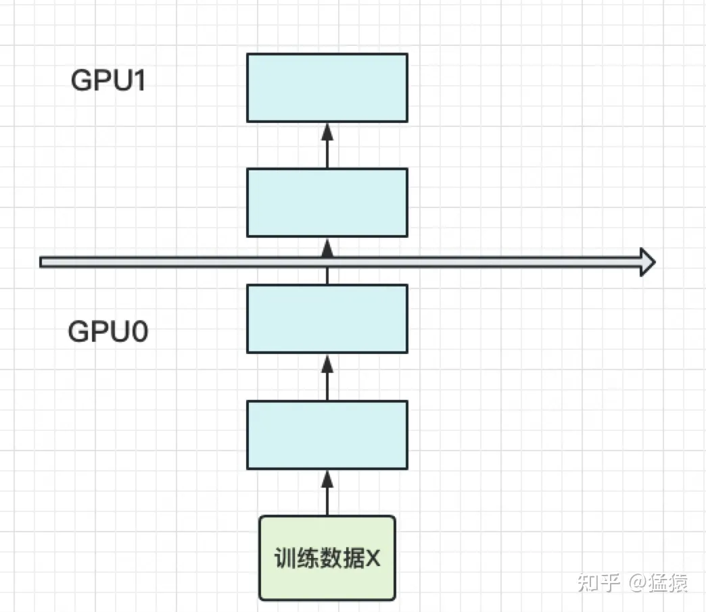
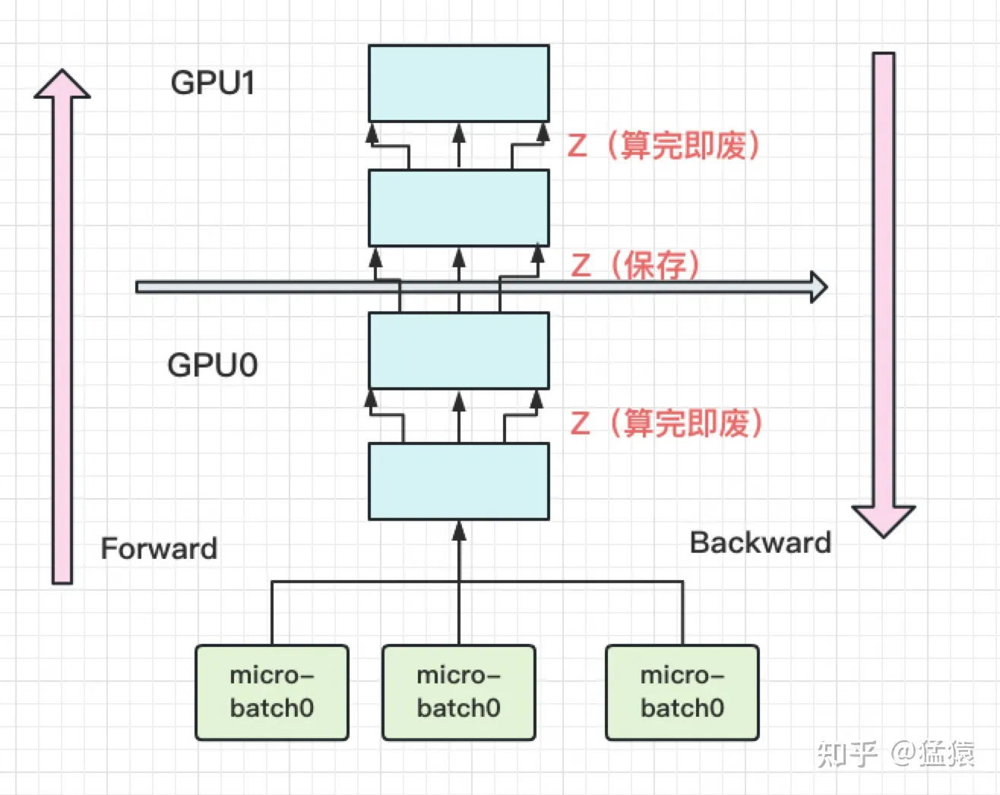
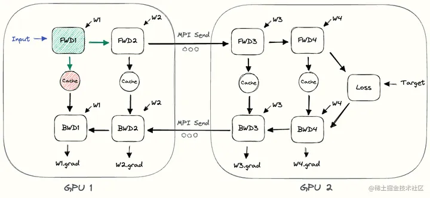
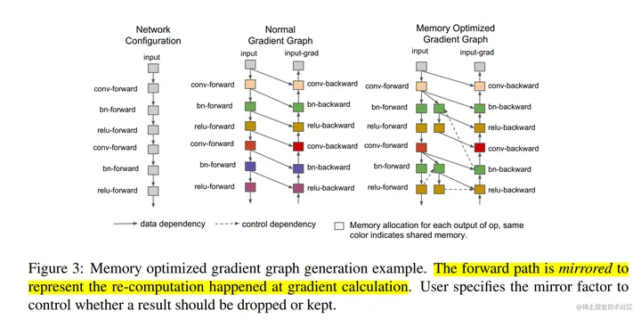

# 【学习笔记】大模型训练：流水线并行

[原文链接](https://zhuanlan.zhihu.com/p/613196255)


> 经典的流水线并行范式有Google推出的**Gpipe**，和微软推出的**PipeDream**。两者的推出时间都在2019年左右，大体设计框架一致。主要差别为：在梯度更新上，Gpipe是同步的，PipeDream是异步的。异步方法更进一步降低了GPU的空转时间比。虽然PipeDream设计更精妙些，但是Gpipe因为其“够用”和浅显易懂，更受大众欢迎（torch的pp接口就基于Gpipe）。因此本文以Gpipe作为流水线并行的范例进行介绍。


分布式训练的总体目标：

* 训练更大的模型
* 更快地训练模型

难点：

* 模型参数和中间结果更多，内存压力大
* GPU之间的传输增大，通信开销大

## 模型并行

将模型隔成不同的层，每一层放到一块GPU上

>  

此时模型前向传输和后向传输

>  

> 其中下标表示batch编号，这里只有一个batch，因此下标都是0。每一行表示一个GPU。每一列表示timestep。
>
> 这张图的含义是：我在GPU0上做完一次forward，然后将GPU0上最后一层的输入传给GPU1，继续做forward，直到四块GPU都做完forward后，我再依次做backward。等把四块GPU上的backward全部做完后，最后一个时刻我统一更新每一层的梯度。

这样会带来以下问题：

* GPU利用度不够
* 中间结果占据大量内存

## 流水线并行

针对上述问题，Gpipe提出了流水线并行。

### 1.切分micro-batch

> **在模型并行的基础上，进一步引入数据并行的办法，即把原先的数据再划分成若干个batch，送入GPU进行训练**。未划分前的数据，叫**mini-batch**。在mini-batch上再划分的数据，叫**micro-batch**。
>
> 

### 2.re-materialization（active checkpoint）

> Gpipe采用了一种非常简单粗暴但有效的办法：**用时间换空间，在论文里，这种方法被命名为re-materalization，后人也称其为active checkpoint**。
> 具体来说，就是**几乎不存中间结果，等到backward的时候，再重新算一遍forward**
>
> 
>
> 每块GPU上，我们只保存来自上一块的最后一层输入z，其余的中间结果我们算完就废。等到backward的时候再由保存下来的z重新进行forward来算出。
>
> 如果你使用Pytorch提供的pipeline接口，其中有一个参数叫checkpoint，就是用来做这一项的。
>
> 在micro-batch的划分下，我们在计算**Batch Normalization**时会有影响。Gpipe的方法是，在训练时计算和运用的是micro-batch里的均值和方差，但同时持续追踪全部mini-batch的移动平均和方差，以便在测试阶段进行使用。Layer Normalization则不受影响。


[原文链接2](https://zhuanlan.zhihu.com/p/653860567)

> 所谓流水线并行，就是由于模型太大，无法将整个模型放置到单张GPU卡中；因此，将模型的不同层放置到不同的计算设备，降低单个计算设备的显存消耗，从而实现超大规模模型训练。
>
> 如下图所示，模型共包含四个模型层（如：Transformer层），被切分为三个部分，分别放置到三个不同的计算设备。即第 1 层放置到设备 0，第 2 层和第三 3 层放置到设备 1，第 4 层放置到设备 2。
>
> 
>
> 相邻设备间通过通信链路传输数据。具体地讲，前向计算过程中，输入数据首先在设备 0 上通过第 1 层的计算得到中间结果，并将中间结果传输到设备 1，然后在设备 1 上计算得到第 2 层和第 3 层的输出，并将模型第 3 层的输出结果传输到设备 2，在设备 2 上经由最后一层的计算得到前向计算结果。反向传播过程类似。最后，各个设备上的网络层会使用反向传播过程计算得到的梯度更新参数。由于各个设备间传输的仅是相邻设备间的输出张量，而不是梯度信息，因此通信量较小。

## 朴素流水线并行

> 
>
> 下面以 4 层顺序模型为例：
>
> ```text
> output=L4(L3(L2(L1(input))))
> ```
>
> 我们将计算分配给两个 GPU，如下所示：
>
> - GPU1 computes: `intermediate=L2(L1(input))`
> - GPU2 computes: `output=L4(L3(intermediate))`
>
> 为了完成前向传播，我们在 GPU1 上计算中间值并将结果张量传输到 GPU2。 然后， GPU2 计算模型的输出并开始进行反向传播。 对于反向传播，我们从 GPU2 到 GPU1 的中间发送梯度。 然后， GPU1 根据发送的梯度完成反向传播。 这样，流水线并行训练会产生与单节点训练相同的输出和梯度。 朴素流水线并行训练相当于顺序训练，这使得调试变得更加容易。
>
> 下面说明了朴素流水线并行执行流程。 GPU1 执行前向传播并缓存激活（红色）。 然后，它使用 MPI 将 L2 的输出发送到 GPU2。 GPU2 完成前向传播，并使用目标值计算损失，完成之后开始反向传播。 一旦 GPU2 完成，梯度的输出被发送到 GPU1，从而完成反向传播。
>
> 请注意，这里仅使用了点到点通信（MPI.Send 和 MPI.Recv），并且不需要任何集体通信原语（因此，不需要 MPI.AllReduce）。
>
> 
>
> 主要是因为该方案在任意给定时刻，除了一个 GPU 之外的其他所有 GPU 都是空闲的。因此，如果使用 4 个 GPU，则几乎等同于将单个 GPU 的内存量增加四倍，而其他资源 (如计算) 相当于没用上。所以，朴素流水线存在很多的Bubble。朴素流水线的 Bubble 的时间为 $O((k-1)/k)$，**当K越大，即GPU的数量越多时，空置的比例接近1，即GPU的资源都被浪费掉了**，因此，朴素的流水线并行将会导致**GPU使用率过低**。
>
> 另外，还需要加上在**设备之间复制数据的通信开销**；所以， 4 张使用朴素流水线并行的 6GB 卡将能够容纳 1 张 24GB 卡相同大小的模型，而后者训练得更快；因为，它没有数据传输开销。
>
> 还有**通信和计算没有交错**的问题：当我们通过网络发送中间输出 (FWD) 和梯度 (BWD) 时，没有 GPU 执行任何操作。
>
> 除此之外，还存在**高内存需求**的问题：先执行前向传播的GPU（如：GPU1）将保留整个小批量缓存的所有激活，直到最后。如果批量大小很大，可能会产生内存问题。

## 微批次流水线执行

> 
>
> 微批次（MicroBatch）流水线并行与朴素流水线几乎相同，但它通过将传入的小批次（minibatch）分块为微批次（microbatch），并人为创建流水线来解决 GPU 空闲问题，从而允许不同的 GPU 同时参与计算过程，可以显著提升流水线并行设备利用率，减小设备空闲状态的时间。目前业界常见的流水线并行方法 GPipe 和 PipeDream 都采用微批次流水线并行方案。

### **GPipe**

> GPipe（Easy Scaling with Micro-Batch Pipeline Parallelism），由谷歌提出的一种流水线并行方案。最早，谷歌在Lingvo框架下开源了GPipe，基于 TensorFlow 库进行实现的。后来，Kakao Brain的工程师用 PyTorch 来实现了 GPipe，并开源出来，也就是 torchgpipe。之后，Facebook的FairScale库将torchgpipe集成到项目中。再后来，Facebook又将FairScale库中关于torchgpipe的部分代码集成到了PyTorch 1.8.0 之后的版本中。torchgpipe 的这部分代码被合并到 `torch/distributed/pipeline/sync` 目录下。
>
> 以下代码是基于PyTorch使用包含两个 FC 层的模型跨 GPU0 和 GPU1 进行流水线并行的示例：
>
> ```text
> # Need to initialize RPC framework first.
> os.environ['MASTER_ADDR'] = 'localhost'
> os.environ['MASTER_PORT'] = '29500'
> torch.distributed.rpc.init_rpc('worker', rank=0, world_size=1)
> 
> # 构建模型
> fc1 = nn.Linear(16, 8).cuda(0)
> fc2 = nn.Linear(8, 4).cuda(1)
> model = nn.Sequential(fc1, fc2)
> 
> from torch.distributed.pipeline.sync import Pipe
> 
> # chunks表示micro-batches的大小，默认值为1
> model = Pipe(model, chunks=8)
> input = torch.rand(16, 16).cuda(0)
> output_rref = model(input)
> ```
>
> Gpipe 流水线并行主要用来解决这两个问题：
>
> 第一，**提高模型训练的并行度**。Gpipe 在朴素流水线并行的基础上，利用数据并行的思想，将 mini-batch 细分为多个更小的 micro-batch，送入GPU进行训练，来提高并行程度。
>
> 
>
> 上图即为朴素流水线并行与 GPipe 微批次流水线并行对比，通过 GPipe 可以有效降低流水线并行bubble 空间的比例。其中，F的第一个下标表示 GPU 编号，F的第二个下标表示 micro-batch 编号。假设我们将 mini-batch 划分为 M 个，则 GPipe 流水线并行下， GPipe 流水线 Bubble 时间为： $O((K-1)/(K+M-1))$。其中，K为设备，M为将mini-batch切成多少个micro-batch。当M>>K的时候，这个时间可以忽略不计。
>
> 但这样做也有一个坏处，那就是把 batch 拆小了之后，对于那些需要统计量的层（如：Batch Normalization），就会导致计算变得麻烦，需要重新实现。在Gpipe中的方法是，在训练时计算和运用的是micro-batch里的均值和方差，同时持续追踪全部mini-batch的移动平均和方差，以便在测试阶段进行使用。这样 Layer Normalization 则不受影响。
>
> 第二，**通过重计算（Re-materialization）降低显存消耗**。在模型训练过程中的前向传播时，会记录每一个算子的计算结果，用于反向传播时的梯度计算。
>
> 
>
> 而 Re-materialization 可以不用保存中间层输出的激活值，在计算梯度的时候会重新计算出来这些激活值从而可以计算梯度。在 GPipe 中，应用了这个技术后，如果一个设备上有多层，那么就可以**只保存多层中的最后一层的输出值**。这样就降低了每个设备上内存占用峰值，同样的模型尺寸需要的显存就少了。
>
> **Re-materialization并非是不需要中间结果，而是有办法在求导过程中实时的计算出之前被舍弃掉的中间结果**。
>
> 简而言之，GPipe 通过纵向对模型进行切分解决了单个设备无法训练大模型的问题；同时，又通过微批量流水线增加了多设备上的并行程度，除此之外，还使用re-materialization降低了单设备上的显存峰值。
>
> 上面讲述了 GPipe 流水线并行方案，接下来讲述一下 PipeDream 。讲述 PipeDream之前，我们先来看看流水线并行策略。

## 流水线并行策略

### F-then-B 策略

> F-then-B 模式，先进行前向计算，再进行反向计算。
>
> F-then-B 模式由于缓存了多个 micro-batch 的中间变量和梯度，显存的实际利用率并不高。
>
> 

### 1F1B 策略

> 1F1B（One Forward pass followed by One Backward pass）模式，一种前向计算和反向计算交叉进行的方式。在 1F1B 模式下，前向计算和反向计算交叉进行，可以及时释放不必要的中间变量。
>
> 
>
> 1F1B 示例如下图所示，以 stage4 的 F42（**stage4 的第 2 个 micro-batch 的前向计算**）为例，F42 在计算前，F41 的反向 B41（stage4 的第 1 个 micro-batch 的反向计算）已经计算结束，即可释放 F41 的中间变量，从而 F42 可以**复用** F41 中间变量的显存。
>
> 研究表明，1F1B 方式相比于 F-then-B 方式，峰值显存可以节省 37.5%，对比朴素流水线并行峰值显存明显下降，设备资源利用率显著提升。

## PipeDream（非交错式1F1B）-DeepSpeed

> 微软 DeepSpeed 提出的 PipeDream ，针对这些问题的改进方法就是 1F1B 策略。这种改进策略可以解决缓存 activation 的份数问题，使得 activation 的缓存数量只跟 stage 数相关，从而进一步节省显存，训练更大的模型。其解决思路就是努力减少每个 activation 的保存时间，即这就需要每个微批次数据尽可能早的完成后向计算，从而让每个 activation 尽可能早释放。
>
> 

to be continue

---

**Todo**

[pytorch流水线并行源码解析](https://zhuanlan.zhihu.com/p/665993846)