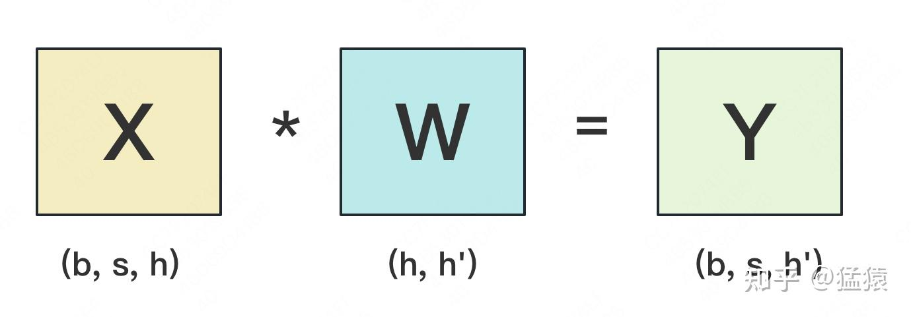
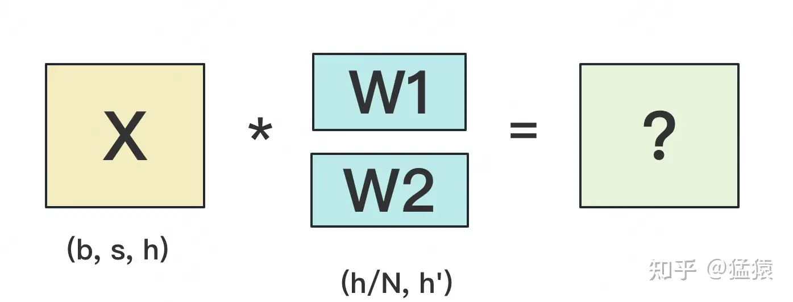

# 【学习笔记】大模型训练：张量并行

[原文链接1](https://zhuanlan.zhihu.com/p/622212228)

# 切分权重

> 设输入数据为X，参数为W。X的维度 = (b, s, h)，W的维度 = (h, h')。其中：
>
> - `b`：batch_size，表示批量大小
> - `s`：sequence_length，表示输入序列的长度
> - `h`：hidden_size，表示每个token向量的维度。
> - `h'`：参数W的hidden_size。
>
> 

## 1. 按行切分

> **(1) forward**
> 我们用`N`来表示GPU的数量。有几块GPU，就把W按行维度切成几份。下图展示了N=2时的切割方式：
>
> 
>
> W按照行维度切开后，X的维度和它不对齐了，这可怎么做矩阵乘法呢？很简单，再把X“按列切开”就行了，如下图所示：
>
> 

## 2.按列切分

> 

# MLP层

> 
>
> 在MLP层中，**对A采用“列切割”，对B采用“行切割”**。
>
> - `f` 的forward计算：把输入X拷贝到两块GPU上，每块GPU即可独立做forward计算。
> - `g` 的forward计算：每块GPU上的forward的计算完毕，取得Z1和Z2后，GPU间做一次**AllReduce**，相加结果产生Z。
>
> 为什么我们对A采用列切割，对B采用行切割呢？**这样设计的原因是，我们尽量保证各GPU上的计算相互独立，减少通讯量**。对A来说，需要做一次GELU的计算，而GELU函数是非线形的，它的性质如下：
>
> 
>
> 如果对A采用行切割，我们必须在做GELU前，做一次AllReduce，这样就会产生额外通讯量。但是如果对A采用列切割，那每块GPU就可以继续独立计算了。
>
> **MLP层做forward时产生一次AllReduce，做backward时产生一次AllReduce**。在[之前](https://zhuanlan.zhihu.com/p/617133971)的文章里我们讲过，AllReduce的过程分为两个阶段，Reduce-Scatter和All-Gather，每个阶段的通讯量都相等。现在我们设每个阶段的通讯量为 $Φ$ ，则**一次AllReduce产生的通讯量为** $2Φ$ **。MLP层的总通讯量为** $4Φ$ 。
> 根据上面的计算图，我们也易知，$ Φ=b∗s∗ℎ$

## Self-Attention层

> self-attention层切割方式（Transformer中Encode和Decoder之间还有做cross-attention，但计算逻辑和self-attention一致，因此这里只拿self-attention举例）
