# Basics of machine learning

The (supervised) ML approach: collect a training set of images with known labels and feed these into a machine learning algorithm, which will (if done well), automatically produce a “program” that solves this task.

Every machine learning algorithm consists of three different elements:

1. **The hypothesis class**: the “program structure”, parameterized via a set of parameters, that describes how we map inputs (e.g., images of digits) to outputs (e.g., class labels, or probabilities of different class labels) .
2. **The loss function**: a function that specifies how “well” a given hypothesis (i.e., a choice of parameters) performs on the task of interest .
3. **An optimization method**: a procedure for determining a set of parameters that (approximately) minimize the sum of losses over the training set.

> supervised 监督 hypothesis 假设 parameters 参数

# Example: softmax regresssion

## Multi-class classification setting

k-class classification setting:

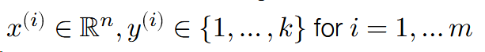

- 𝑛 = dimensionality of the input data
- 𝑘 = number of different classes / labels
- 𝑚 = number of points in the training set

Where x{i} represents n-dimensional vector, y{i} represents discrete scalars, this will be discussed below.

> re gresssion 回归 dimensionality 维度

## Linear hypothesis function

Hypothesis function maps inputs 𝑥 ∈ ℝ𝑛 to 𝑘-dimensional vectors:

$$
h:\mathbb{R}^{n}\rightarrow \mathbb{R}^{k}
$$

where â„ğ‘–(ğ‘¥) indicates some measure of “belief†in how much likely the label is to be class ğ‘– (i.e., “most likely†prediction is coordinate ğ‘– with largest â„ğ‘–(ğ‘¥)).

A linear hypothesis function uses a linear operator (i.e. matrix multiplication) for this transformation:

$$
\ h_{\theta}(x)=\theta^{T}x
$$

where T represents the transpose of the matrix, theta represents matrix with n rows and n columns.

$$
\theta\in\mathbb{R}^{n\times k}
$$

Often more convenient (and this is how you want to code things for efficiency) to write the data and operations in matrix batch form.

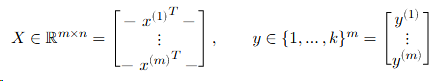

Then the linear hypothesis applied to this batch can be written as

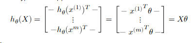

## Loss function #1: classification error

The simplest loss function to use in classification is just the classification error, i.e., whether the classifier makes a mistake a or not.

We typically use this loss function to assess the quality of classifiers Unfortunately, the error is a bad loss function to use for optimization, i.e., selecting the best parameters, because it is not differentiable.

> differentiable 不可微分的

## Loss function #2: softmax / cross-entropy loss

Convert the hypothesis function to a “probability” by exponentiating and normalizing its entries (to make them all positive and sum to one).

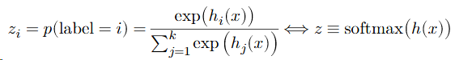

define a loss to be the (negative) log probability of the true class: this is called softmax or cross-entropy loss.

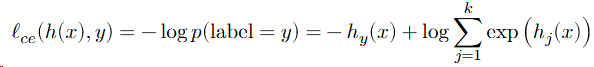

> cross-entropy 交叉熵 exponentiating 求幂 normalizing 标准化 negative log 负对数

## The softmax regression optimization problem

The core machine learning optimization problem.

The third ingredient of a machine learning algorithm is a method for solving the associated optimization problem, i.e., the problem of minimizing the average loss on the training set

$$
\mathrm{minimize}\;\frac{1}{m}\sum_{i=1}^{m}\ell(h_{\theta}(x^{(i)}),y^{(i)})
$$

For softmax regression (i.e., linear hypothesis class and softmax loss):

$$
mininize\ {\frac{1}{m}}\sum_{i=1}^{m}\ell_{c e}(\theta^{T}x^{(i)},y^{(i)})
$$

## Optimization: gradient descent

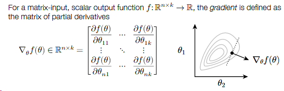

The derivative of a function was equal to the slope of that function. Well, that same intuition holds in higher dimensions too.

Gradient points in the direction that most increases 𝑓 (locally).

To minimize a function, the gradient descent algorithm proceeds by iteratively taking steps in the direction of the negative gradient.

$$
\theta:=\theta-\alpha\nabla_{\theta}f(\theta)
$$

where 𝛼 > 0 is a step size or learning rate.

> gradient 梯度 descent 下降 partial derivatives 偏导数 slope 斜率

## Stochastic gradient descent

If our objective (as is the case in machine learning) is the sum of individual losses, we don’t want to compute the gradient using all examples to make a single update to the parameters.

Instead, take many gradient steps each based upon a minibatch (small partition of the data), to make many parameter updates using a single “pass” over data.

> stochastic 随机 parameters 参数 minibatch 小批量

for vector ℎ ∈ ℝ𝑘

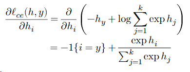

So

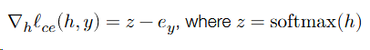

e is clalled the unit basis(-1{i=y}).

But in the left, it exists the chain rule of multivariate calculus ...

**Approach #1 (a.k.a. the right way):**

Use matrix differential calculus, Jacobians, Kronecker products, and vectorization

**Approach #2 (a.k.a. the hacky quick way that everyone actually does):**

Pretend everything is a scalar, use the typical chain rule, and then rearrange / transpose matrices/vectors to make the sizes work 😱 (and check your answer numerically)

> multivariate calculus 多元微积分 differential 微分 Jacobians 雅可比行列式 transpose 转置

**the “derivative” of the loss:**

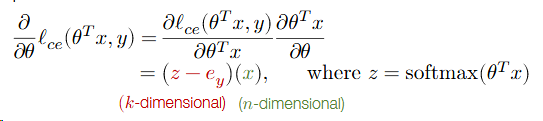

Now it is k×1 and n×1, but we need n×k matrix. So

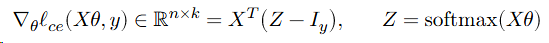

So, putting it all together.

Repeat until parameters / loss converges:

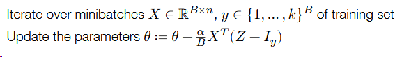

## 自动微分

* forward计算图

> 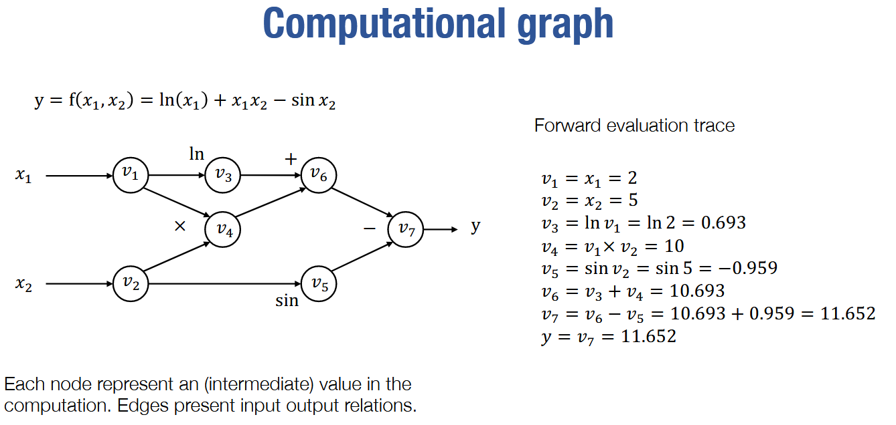

* backward计算图

> 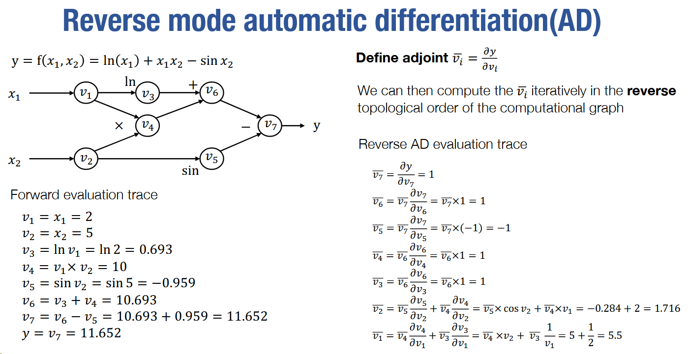

* 同时需要考虑在不同道路中被使用的反向微分

> 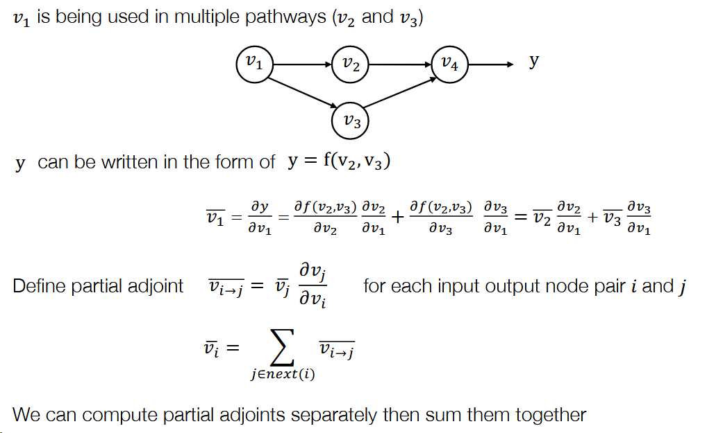

* 反向自动微分代码

## 全连接

> A 𝐿-layer, fully connected network, a.k.a. **multi-layer perceptron (MLP)**, now with an explicit bias term, is defined by the iteration.
>
> 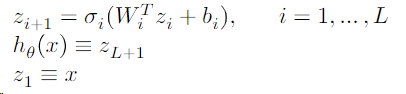
>
> 参数$\theta=\{W_{1:L},b_{1:L}\}$，$\sigma_{i}$一般是非线性的激活，一种常用的方法是$\sigma_{L}(x)=x$

## 优化器

* 梯度下降法

> 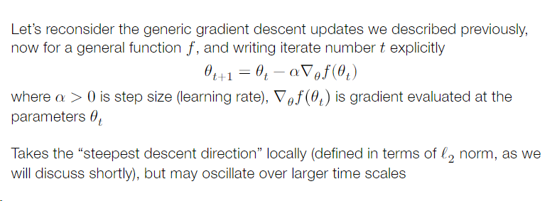
>
> 学习率$\times$梯度

* Newton’s Method

> 根据Hessian（二维导数矩阵）
>
> 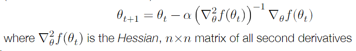
>
> 等价于使用二阶泰勒展开将函数近似为二次函数，然后求解最优解

* Momentum

> 一种考虑更多的中间结构-momentum update，考虑先前梯度移动的平均值
>
> 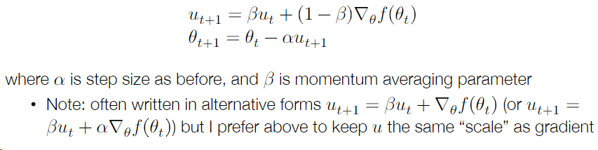

* “Unbiasing” momentum terms
* Nesterov Momentum
* Adam

> Whether Adam is “good” optimizer is endlessly debated within deep learning, but it often seems to work quite well in practice (maybe?)

* Stochastic Gradient Descent

## Initialization

初始化跟大模型推理貌似无关，就没深入学习了

## Normalization 

需要看视频才看得懂，晚点补

## Regularization

需要看视频才看得懂，晚点补

## Transformer

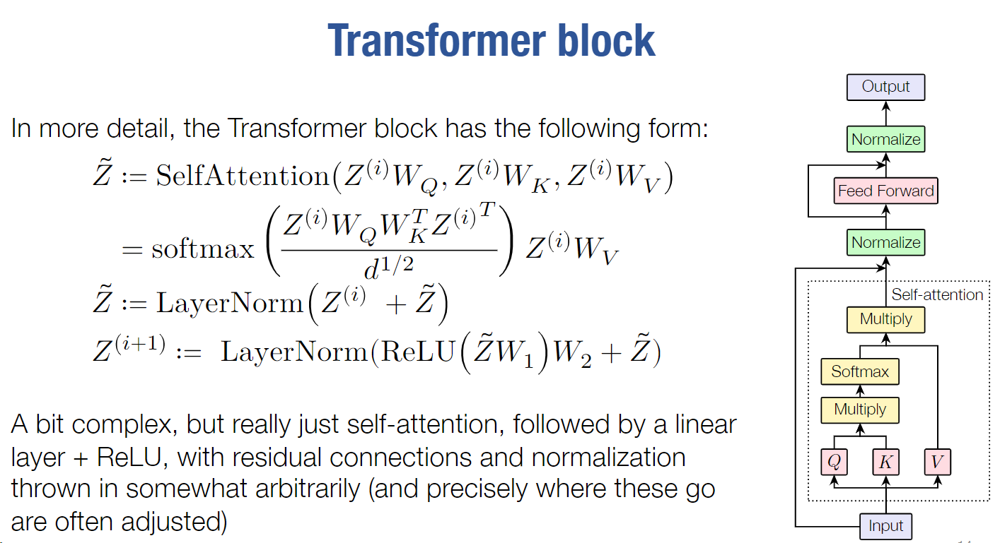