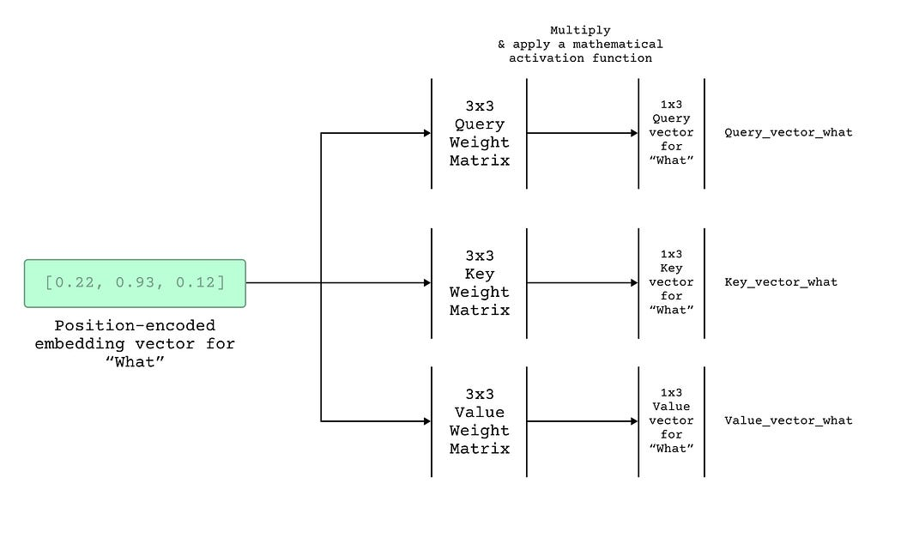
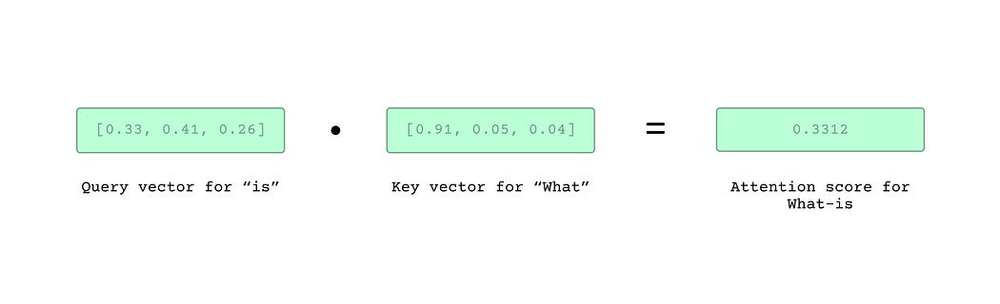
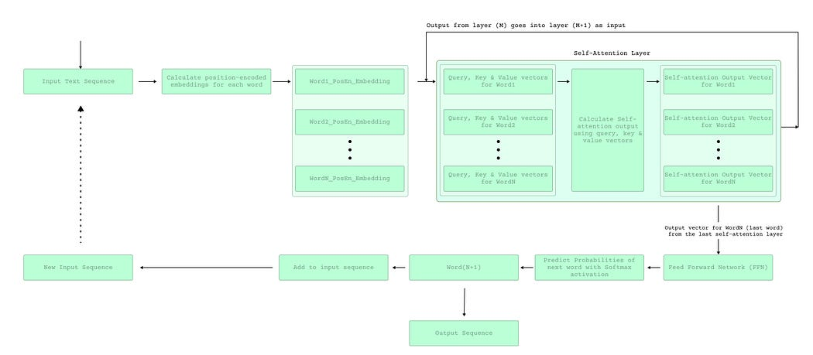

# 【学习笔记】自回归模型和GPT

[原文链接](https://medium.com/@sntaus/understanding-self-attention-gpt-models-80ec894eebf0)

## 基础知识

### 输入数据

1. 词嵌入。将词变成向量，句子变成向量集合。
2. 通过数学方法将位置编码嵌入到词向量中。

### Query, Key, Value

> 1. Use the vector to create a *query vector* for that word in that position — this just means the input position encoded vector goes through a mathematical function (whose parameters are trained during training) to produce a new vector that is referred to as the *query* vector.
>
>    输入向量通过数学方式生成query向量
>
> 2. Use the vector to create a *key vector* for that word in that position —i.e. the input position encoded vector goes through *another* (different) mathematical function to produce another new vector that is referred to as the *key* vector.
>
>    输入向量通过另一种数学方式生成key向量
>
> 3. Use the vector to create a *value vector* for that word in that position — i.e. the vector goes through *yet another* mathematical function to produce yet another new vector that is referred to as the *value* vector.
>
>    输入向量通过另一种数学方式生成value向量
>
> 
>
> 数学方法主要是权重矩阵
>
> 
>
> 并在后续使用softmax保证分数没太大区别。
>
> 

### 进一步流程

> 

## How does all of it happen so fast so many times?

> First, the model does not have to recompute query, key, value vectors each time for the words preceding the last output word since it already did it in previous stages and can re-use those values.
>
> 不需要每次都计算KQV
>
> Secondly, most of the steps in the self-attention layer can be parallelized.
>
> 自注意力层可以并行
>
> Lastly, there’s likely various optimizations both within the network like pruning and at the hardware level that can be leveraged to speed up inference time even more.
>
> 可能会有修剪或各方面的硬件优化

##  how does the model learn?

采用反向传播梯度下降

> 1. The model is given an input sequence and it predicts the next word using self-attention.
>
>    根据自注意力预测下一个单词
>
> 2. If the predicted next word is not the same as the expected next word, the model parameters are updated using gradient descent.
>
>    跟真实情况有差距的话就使用梯度下降更新模型参数
>
> 3. This process is repeated for numerous times using a large training dataset (with labelled input and expected output).
>
>    使用大型训练数据集不断重复该过程

且这种大模型与transformer不同的话是其仅使用decoder。


### 代码细节

[代码地址](https://github.com/vllm-project/vllm/blob/v0.2.7/vllm/model_executor/models/llama.py)

---

LlamaForCausalLM开始forward，调用LlamaModel的forward函数，返回隐藏层输出状态。

```python
class LlamaForCausalLM(nn.Module):
    #通过LlamaModel得到输出状态
    def forward(
        self,
        input_ids: torch.Tensor,
        positions: torch.Tensor,
        kv_caches: List[KVCache],
        input_metadata: InputMetadata,
    ) -> torch.Tensor:
        hidden_states = self.model(input_ids, positions, kv_caches,
                                   input_metadata)
        return hidden_states
```


---

这里先介绍RmsNorm，均方根归一化，后文多次用到


```python
class RMSNorm(nn.Module):
    """Root mean square normalization.

    Computes x -> w * x / sqrt(E[x^2] + eps) where w is the learned weight.
    Refer to https://arxiv.org/abs/1910.07467
    """
    def forward(
        self,
        x: torch.Tensor,
        residual: Optional[torch.Tensor] = None,
    ) -> Union[torch.Tensor, Tuple[torch.Tensor, torch.Tensor]]:
        # 如果有残差向量，调用加速，进行计算
        if residual is not None:
            ops.fused_add_rms_norm(
                x,
                residual,
                self.weight.data,
                self.variance_epsilon,
            )
            return x, residual
        # 如果没有残差向量，创建一个和x一样的out进行计算
        out = torch.empty_like(x)
        ops.rms_norm(
            out,
            x,
            self.weight.data,
            self.variance_epsilon,
        )
        return out
```


---

LlamaModel forward先进行词嵌入，再循环进行N次decoder操作（调用LlamaDecoderLayer的forward）

```python
class LlamaModel(nn.Module):
    def forward(
        self,
        input_ids: torch.Tensor,
        positions: torch.Tensor,
        kv_caches: List[KVCache],
        input_metadata: InputMetadata,
    ) -> torch.Tensor:
        hidden_states = self.embed_tokens(input_ids)	#词嵌入
        residual = None
        for i in range(len(self.layers)):	#循环每一层，每次进行一个decoder处理
            layer = self.layers[i]			
            hidden_states, residual = layer(
                positions,
                hidden_states,
                kv_caches[i],
                input_metadata,
                residual,
            )
        hidden_states, _ = self.norm(hidden_states, residual) #RMSNorm归一化返回一个状态
        return hidden_states
```
---

LlamaDecoderLayer

先根据残差向量计算（调用ResNorm实现归一化）

然后调用注意力机制的forward计算attention

然后调用ResNorm再进行归一化

最后调用mlp线性层

**那么，**

**1. 前面hidden_states 对应的residual计算部分对应的内容可以在哪里查阅到？**

**2. 我的理解是这里跟resnet相似，那不需要最后add残差向量吗？**

```python
class LlamaDecoderLayer(nn.Module):
    def forward(
        self,
        positions: torch.Tensor,
        hidden_states: torch.Tensor,
        kv_cache: KVCache,
        input_metadata: InputMetadata,
        residual: Optional[torch.Tensor],
    ) -> Tuple[torch.Tensor, torch.Tensor]:
        # Self Attention
        # 根据残差向量计算隐藏层
        if residual is None:
            residual = hidden_states
            hidden_states = self.input_layernorm(hidden_states) # ResNorm
        else:
            hidden_states, residual = self.input_layernorm( # ResNorm
                hidden_states, residual)
        # 计算attention
        hidden_states = self.self_attn(
            positions=positions,
            hidden_states=hidden_states,
            kv_cache=kv_cache,
            input_metadata=input_metadata,
        )
		
        # Fully Connected
        hidden_states, residual = self.post_attention_layernorm( # ResNorm
            hidden_states, residual)
        hidden_states = self.mlp(hidden_states) # mlp线性层
        return hidden_states, residual

```

---

LlamaAttention先调用了QKVParallelLinear来**计算 ___？**gpt说是将隐藏状态对K、Q、V投影

再调用了qkv.split，**这是哪里的？**gpt说是将投影的张量分割成K、Q、V

再调用rotary_emb，是另外一个文件中的get_rope。**不知道干什么的。**gpt说使用 `rotary_emb` 层对查询和键进行旋转位置编码。

调用PageAttention计算attention

最后调用RowParallelLinear来计算结果，**干什么的？**gpt说通过 `o_proj` 对注意力计算的输出进行投影，得到最终的输出。


**投影是指？**


总而言之，这里就是attention的计算部分，**需要后面找文献和公式对应一下**

```python
class LlamaAttention(nn.Module):
        def forward(
        self,
        positions: torch.Tensor, # 位置张量
        hidden_states: torch.Tensor, # 隐藏状态张量
        kv_cache: KVCache, # 键值缓存，主要是vllm的一个特色，用来存QKV的
        input_metadata: InputMetadata, #输入的元数据信息
    ) -> torch.Tensor:
        qkv, _ = self.qkv_proj(hidden_states) # 分块计算
        q, k, v = qkv.split([self.q_size, self.kv_size, self.kv_size], dim=-1)
        q, k = self.rotary_emb(positions, q, k)
        k_cache, v_cache = kv_cache
        attn_output = self.attn(q, k, v, k_cache, v_cache, input_metadata) # pageAttention计算
        output, _ = self.o_proj(attn_output) # 分块计算
        return output
```

---

LlamaMLP主要就是一个MLP部分

先将输入参数x进行投影，得到gate_up

中间层输出经过act_fn激活

最后将激活后的结果进行投影

得到输出

```python
class LlamaMLP(nn.Module):
    def forward(self, x):
        gate_up, _ = self.gate_up_proj(x)
        x = self.act_fn(gate_up)
        x, _ = self.down_proj(x)
        return x
```


