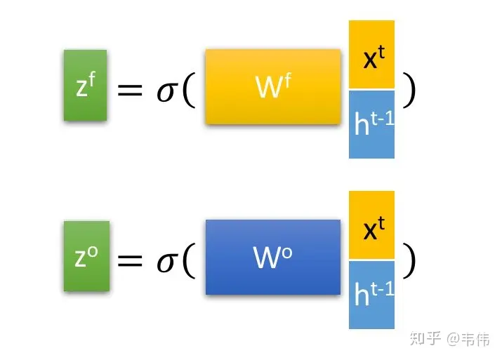

# 循环神经网络

## 【学习笔记】史上最详细循环神经网络讲解（RNN/LSTM/GRU）

[原文链接](https://zhuanlan.zhihu.com/p/123211148)

* ### 循环神经网络（RNN）

  * #### 什么是循环神经网络


  > **循环神经网络（Rerrent Neural Network, RNN）**对具有**序列特性**的数据非常有效，它能挖掘数据中的时序信息以及语义信息，利用了RNN的这种能力，使深度学习模型在解决语音识别、语言模型、机器翻译以及时序分析等NLP领域的问题时有所突破。

  * #### 为什么要发展循环神经网络


  > 我们先来看一个NLP很常见的问题，命名实体识别，举个例子，现在有两句话：
  >
  > 第一句话：I like eating apple！（我喜欢吃苹果！）
  >
  > 第二句话：The Apple is a great company！（苹果真是一家很棒的公司！）
  >
  > 现在的任务是要给apple打Label，我们都知道第一个apple是一种水果，第二个apple是苹果公司，假设我们现在有大量的已经标记好的数据以供训练模型，当我们使用**全连接的神经网络**时，我们做法是把apple这个单词的特征向量输入到我们的模型中，在输出结果时，让我们的label里，正确的label概率最大，来训练模型，但我们的语料库中，有的apple的label是水果，有的label是公司，这将导致，模型在训练的过程中，预测的准确程度，取决于训练集中哪个label多一些，这样的模型对于我们来说完全没有作用。**问题就出在了我们没有结合上下文去训练模型，而是单独的在训练apple这个单词的label，这也是全连接神经网络模型所不能做到的，于是就有了我们的循环神经网络。**

  * ####  循环神经网络的结构及原理


  > 
  >
  > 先不管右边的W，只看X,U,S,V,O，这幅图就变成了，如下：
  >
  > 
  >
  > 这就是我们的**全连接神经网络结构**。
  >
  > 把这幅图打开，就是RNN可以解决序列问题的原因：**可以记住每一时刻的信息，每一时刻的隐藏层不仅由该时刻的输入层决定，还由上一时刻的隐藏层决定**
  >
  > 
  >
  > 公式如下，$O_t代表t时刻的输出，S_t代表t时刻隐藏层的值$：
  >
  > 
  >
  > **值得注意的一点是，在整个训练过程中，每一时刻所用的都是同样的W。**


* ### LSTM（Long short-term memory）

  * #### 基础版本RNN的问题

    > 每一时刻的隐藏状态都不仅由该时刻的输入决定，还取决于上一时刻的隐藏层的值，如果一个句子很长，到句子末尾时，它将记不住这个句子的开头的内容详细内容。（梯度消失或爆炸）

  * #### LSTM

    > 打个比喻吧，普通RNN就像一个乞丐，路边捡的，别人丢的，什么东西他都想要，什么东西他都不嫌弃，LSTM就像一个贵族，没有身份的东西他不要，他会精心挑选符合自己身份的物品。
    >
    > 
    >
    > 普通RNN只有中间的Memory Cell用来存所有的信息
    >
    > **依次来解释一下这三个门：**
    >
    > 1. Input Gate：中文是输入门，在每一时刻从输入层输入的信息会首先经过输入门，输入门的开关会决定这一时刻是否会有信息输入到Memory Cell。
    > 2. Output Gate：中文是输出门，每一时刻是否有信息从Memory Cell输出取决于这一道门。
    > 3. Forget Gate：中文是遗忘门，每一时刻Memory Cell里的值都会经历一个是否被遗忘的过程，就是由该门控制的，如果打卡，那么将会把Memory Cell里的值清除，也就是遗忘掉。
    >
    > LSTM内部结构：
    >
    > 
    >
    > 图中最中间的地方，Cell，我们上面也讲到了memory cell，也就是一个记忆存储的地方，这里就类似于普通RNN的 $S_t$ ，都是用来存储信息的，这里面的信息都会保存到下一时刻，其实标准的叫法应该是$h_t$，因为这里对应神经网络里的隐藏层，所以是hidden的缩写，无论普通RNN还是LSTM其实t时刻的记忆细胞里存的信息，都应该被称为 $h_t$ 。再看最上面的 $a$ ，是这一时刻的输出，也就是类似于普通RNN里的$O_t$​ 。普通RNN里有个 $X_t$作为输入，那LSTM的输入在哪？$Z$,$Z_i$,$Z_f$,$Z_o$都有输入向量$X_t$的参与。
    >
    > 
    >
    > 现在再解释图中的符号
    >
    > 
    >
    > 表示一个激活符号，LSTM里常用的激活函数有两个，一个是tanh，一个是sigmoid
    >
    > 
    >
    > 
    >
    > 其中$Z$是最为普通的输入，可以从上图中看到，$Z$是通过该时刻的输入$X_t$和上一时刻存在memory cell里的隐藏层信息$h_{t-1}$向量拼接，再与权重参数向量$W$点积，得到的值经过激活函数tanh最终会得到一个数值，也就是$Z$，注意只有$Z$的激活函数是tanh，因为$Z$是真正作为输入的，其他三个都是门控装置。
    >
    > $Z_i$ ，input gate的缩写i，所以也就是输入门的门控装置， $Z_i$同样也是通过该时刻的输入 $X_t$和上一时刻隐藏状态，也就是上一时刻存下来的信息$h_{t-1}$ 向量拼接，在与权重参数向量$W_i$点积（注意每个门的权重向量都不一样，这里的下标i代表input的意思，也就是输入门）。得到的值经过激活函数sigmoid的最终会得到一个0-1之间的一个数值，用来作为输入门的控制信号。
    >
    > $Z_f$和$Z_o$同理，分别代表forget和output的门控装置。
    >
    > 经过这个sigmod激活函数后，得到的$Z_i$,$Z_f$,$Z_o$都是在0到1之间的数值，1表示该门完全打开，0表示该门完全关闭。
    
    

​	

## 【学习笔记】从零开始实现循环神经网络（无框架）

[原文链接](https://zhuanlan.zhihu.com/p/226048698)

* ### 循环神经网络

  > 
  >
  > * x为序列输入
  >
  > - U 为连接每一时刻输入层与隐藏层的权重矩阵
  > - V为连接上一时刻与下一时刻隐藏层的权重矩阵
  > - U为连接每一时刻隐藏层与输出层的权重矩阵
  > - h为隐藏状态单元
  > - o为输出状态单元
  >
  > 对于每一时刻
  >
  > * $h_t=f(Ux_t+Vh_{t-1})$，其中f为激活函数，如tanh
  > * $o_t=softmax(Wh_t)$

  * ### 函数初始化

    ```python
    hidden_size = 50 # 隐藏层神经元个数
    vocab_size  = 4 # 词汇表大小
    def init_orthogonal(param):
        """
        正交初始化.
        """
        if param.ndim < 2:
            raise ValueError("参数维度必须大于2.")
        rows, cols = param.shape
        # 生成指定大小的服从标准正态分布（均值为0，方差为1）的随机数矩阵
        new_param = np.random.randn(rows, cols) 
        if rows < cols:
            new_param = new_param.T 
        # QR 矩阵分解， q为正交矩阵，r为上三角矩阵
        q, r = np.linalg.qr(new_param)
        # 让q均匀分布，https://arxiv.org/pdf/math-ph/0609050.pdf
        	# 从上三角矩阵R中提取对角线元素，并将其存储在一个一维数组d中。参数0表示我们希望提取的对角线位于R的主对角线上。
        d = np.diag(r, 0)
        	# 这行代码对d中的每个元素取符号，即将正数映射为+1，负数映射为-1，零保持不变。
            # 这样做是为了获得一个与d相同大小的数组ph，其中元素的值只能为+1、-1或0。
        ph = np.sign(d)
        	# 将正交矩阵Q的每一列都乘以对应的ph数组元素，从而调整了Q的方向。
            # 乘以-1的列意味着对应的特征向量在QR分解中被反转了。通过这样的调整，确保了Q矩阵的对角线元素为正数。
        q *= ph
        if rows < cols:
            q = q.T
        new_param = q
        return new_param
    
    def init_rnn(hidden_size, vocab_size):
        """
        初始化循环神经网络参数.
        Args:
        hidden_size: 隐藏层神经元个数
        vocab_size: 词汇表大小
        """
        # 输入到隐藏层权重矩阵
        U = np.zeros((hidden_size, vocab_size))
        # 隐藏层到隐藏层权重矩阵
        V = np.zeros((hidden_size, hidden_size))
        # 隐藏层到输出层权重矩阵
        W = np.zeros((vocab_size, hidden_size))
        # 隐层bias
        b_hidden = np.zeros((hidden_size, 1))
        # 输出层bias
        b_out = np.zeros((vocab_size, 1))
        # 权重初始化
        U = init_orthogonal(U)
        V = init_orthogonal(V)
        W = init_orthogonal(W)   
        return U, V, W, b_hidden, b_out
    ```

  * ### 激活函数

    > 

    ```python
    def sigmoid(x, derivative=False):
        """
        Args:
        x: 输入数据x
        derivative: 如果为True则计算梯度
        """
        x_safe = x + 1e-12
        f = 1 / (1 + np.exp(-x_safe))
        if derivative: 
            return f * (1 - f)
        else: 
            return f
    def tanh(x, derivative=False):
        x_safe = x + 1e-12
        f = (np.exp(x_safe)-np.exp(-x_safe))/(np.exp(x_safe)+np.exp(-x_safe))
        if derivative: 
            return 1-f**2
        else: 
            return f
    def softmax(x, derivative=False):
        x_safe = x + 1e-12
        f = np.exp(x_safe) / np.sum(np.exp(x_safe))
        
        if derivative:
            pass # 本文不计算softmax函数导数
        else: 
            return f
    ```

  * ### RNN前向传播

    ```python
    def forward_pass(inputs, hidden_state, params):
        """
        RNN前向传播计算
        Args:
        inputs: 输入序列
        hidden_state: 初始化后的隐藏状态参数
        params: RNN参数
        """
        U, V, W, b_hidden, b_out = params
        outputs, hidden_states = [], []
        
        for t in range(len(inputs)):
            # 计算隐藏状态
            hidden_state = tanh(np.dot(U, inputs[t]) + np.dot(V, hidden_state) + b_hidden)
            # 计算输出
            out = softmax(np.dot(W, hidden_state) + b_out)
            # 保存中间结果
            outputs.append(out)
            hidden_states.append(hidden_state.copy())
        return outputs, hidden_states
    ```

  * ## RNN后向传播

    ```python
    def clip_gradient_norm(grads, max_norm=0.25):
        """
        梯度剪裁防止梯度爆炸
        """ 
        max_norm = float(max_norm)
        total_norm = 0
        # 对梯度列表进行遍历
        for grad in grads:
            # 计算当前梯度的平方范数
            grad_norm = np.sum(np.power(grad, 2))
            total_norm += grad_norm
        # 所有梯度的总范数
        total_norm = np.sqrt(total_norm)
        # 计算剪裁系数
        clip_coef = max_norm / (total_norm + 1e-6)
        # 剪裁梯度
        if clip_coef < 1:
            for grad in grads:
                grad *= clip_coef
        return grads
    def backward_pass(inputs, outputs, hidden_states, targets, params):
        """
        后向传播
        Args:
         inputs: 序列输入
         outputs: 输出
         hidden_states: 隐藏状态
         targets: 预测目标
         params: RNN参数
        """
        U, V, W, b_hidden, b_out = params
        d_U, d_V, d_W = np.zeros_like(U), np.zeros_like(V), np.zeros_like(W)
        d_b_hidden, d_b_out = np.zeros_like(b_hidden), np.zeros_like(b_out)
        # 跟踪隐藏层偏导及损失
        d_h_next = np.zeros_like(hidden_states[0])
        loss = 0
        # 对于输出序列当中每一个元素，反向遍历 s.t. t = N, N-1, ... 1, 0
        for t in reversed(range(len(outputs))):
            # 交叉熵损失
            loss += -np.mean(np.log(outputs[t]+1e-12) * targets[t])
            # d_loss/d_o
            d_o = outputs[t].copy()
            d_o[np.argmax(targets[t])] -= 1  
            # d_o/d_w
            d_W += np.dot(d_o, hidden_states[t].T)
            d_b_out += d_o   
            # d_o/d_h
            d_h = np.dot(W.T, d_o) + d_h_next
            # Backpropagate through non-linearity
            d_f = tanh(hidden_states[t], derivative=True) * d_h
            d_b_hidden += d_f  
            # d_f/d_u
            d_U += np.dot(d_f, inputs[t].T)
            # d_f/d_v
            d_V += np.dot(d_f, hidden_states[t-1].T)
            d_h_next = np.dot(V.T, d_f)
        grads = d_U, d_V, d_W, d_b_hidden, d_b_out    
        # 梯度裁剪
        grads = clip_gradient_norm(grads)
        return loss, grads
    ```

  * ### 梯度优化

    ```python
    # 随机梯度下降法
    def update_parameters(params, grads, lr=1e-3):
        # lr， learning rate， 学习率
        for param, grad in zip(params, grads):
            param -= lr * grad
        return params
    ```

* LSTM

  > 
  >
  > 
  >
  > 包含5个基本组件，它们是：
  >
  > - 单元状态（cell_state）-储存短期记忆和长期记忆的储存单元
  > - 隐藏状态(hidden_state) -根据当前输入、先前的隐藏状态和当前单元状态信息计算得到的输出状态信息
  > - 输入门（input_gate）-控制从当前输入流到单元状态的信息量
  > - 遗忘门（forget_gate）-控制当前输入和先前单元状态中有多少信息流入当前单元状态
  > - 输出门（output_gate）-控制有多少信息从当前单元状态进入隐藏状态
  >
  > 
  >
  > 三个门控单元及一个细胞状态单元的输入都是一样的，都是当前时刻的输入$x_t$以及上一个隐藏状态$h_{t-1}$, 但是他们的参数是不同的，同时细胞状态单元使用的是$tanh$激活函数。
  >
  > 遗忘门$f_t$，上一细胞状态$c_{t-1}$, 记忆门$i_t$ 及当前细胞状态一起决定输出细胞状态 $c_t$。
  >
  > 输出门 $o_t$及 $c_t$共同决定隐藏状态输出 $h_t$。

  * ## 参数初始化

    ```python
    # 输入单元 + 隐藏单元 拼接后的大小
    z_size = hidden_size + vocab_size 
    def init_lstm(hidden_size, vocab_size, z_size):
        """
        LSTM网络初始化
        Args:
         hidden_size: 隐藏单元大小
         vocab_size: 词汇表大小
         z_size: 隐藏单元 + 输入单元大小
        """
        # 遗忘门参数矩阵及偏置
        W_f = np.random.randn(hidden_size, z_size)
        b_f = np.zeros((hidden_size, 1))
        # 记忆门参数矩阵及偏置
        W_i = np.random.randn(hidden_size, z_size)
        b_i = np.zeros((hidden_size, 1))
        # 细胞状态参数矩阵及偏置
        W_g = np.random.randn(hidden_size, z_size)
        b_g = np.zeros((hidden_size, 1))
        # 输出门参数矩阵及偏置
        W_o = np.random.randn(hidden_size, z_size)
        b_o = np.zeros((hidden_size, 1))
        # 连接隐藏单元及输出的参数矩阵及偏置
        W_v = np.random.randn(vocab_size, hidden_size)
        b_v = np.zeros((vocab_size, 1))
        # 正交参数初始化
        W_f = init_orthogonal(W_f)
        W_i = init_orthogonal(W_i)
        W_g = init_orthogonal(W_g)
        W_o = init_orthogonal(W_o)
        W_v = init_orthogonal(W_v)
        return W_f, W_i, W_g, W_o, W_v, b_f, b_i, b_g, b_o, b_v
    ```

  * LSTM前向计算

    ```python
    def forward(inputs, h_prev, C_prev, p):
        """
        Arguments:
        inputs: [..., x, ...],  x表示t时刻的数据,  x的维度为(n_x, m).
        h_prev： t-1时刻的隐藏状态数据，维度为 (n_a, m)
        C_prev： t-1时刻的细胞状态数据，维度为 (n_a, m)
        p：列表，包含LSTM初始化当中所有参数:
                            W_f： (n_a, n_a + n_x)
                            b_f： (n_a, 1)
                            W_i： (n_a, n_a + n_x)
                            b_i： (n_a, 1)
                            W_g： (n_a, n_a + n_x)
                            b_g： (n_a, 1)
                            W_o： (n_a, n_a + n_x)
                            b_o： (n_a, 1)
                            W_v： (n_v, n_a)
                            b_v： (n_v, 1)
        Returns:
        z_s, f_s, i_s, g_s, C_s, o_s, h_s, v_s：每一次前向传播后的中间输出
        outputs：t时刻的预估值， 维度为(n_v, m)
        """
        assert h_prev.shape == (hidden_size, 1)
        assert C_prev.shape == (hidden_size, 1)
        W_f, W_i, W_g, W_o, W_v, b_f, b_i, b_g, b_o, b_v = p
        # 保存各个单元的计算输出值
        x_s, z_s, f_s, i_s,  = [], [] ,[], []
        g_s, C_s, o_s, h_s = [], [] ,[], []
        v_s, output_s =  [], [] 
        h_s.append(h_prev)
        C_s.append(C_prev)
        for x in inputs:
            # 拼接输入及隐藏状态单元数据
            z = np.row_stack((h_prev, x))
            z_s.append(z)
            # 遗忘门计算
            f = sigmoid(np.dot(W_f, z) + b_f)
            f_s.append(f)
            # 输入门计算
            i = sigmoid(np.dot(W_i, z) + b_i)
            i_s.append(i) 
            # 细胞状态单元计算
            g = tanh(np.dot(W_g, z) + b_g)
            g_s.append(g)
            # 下一时刻细胞状态计算
            C_prev = f * C_prev + i * g 
            C_s.append(C_prev)
            # 输出门计算
            o = sigmoid(np.dot(W_o, z) + b_o)
            o_s.append(o)
            # 隐藏状态单元计算
            h_prev = o * tanh(C_prev)
            h_s.append(h_prev)
            # 计算预估值
            v = np.dot(W_v, h_prev) + b_v
            v_s.append(v)
            # softmax转换
            output = softmax(v)
            output_s.append(output)
        return z_s, f_s, i_s, g_s, C_s, o_s, h_s, v_s, output_s
    ```

  * ## LSTM后向传播

    ```python
    def backward(z, f, i, g, C, o, h, v, outputs, targets, p = params):
        """
        Arguments:
        z，f，i，g，C，o，h，v，outputs：对应前向传播输出
        targets： 目标值
        p：W_f，b_f，W_i，b_i，W_g，b_g，W_o，b_o，W_v，b_v， LSTM参数
        Returns:
        loss：交叉熵损失
        grads：p中参数的梯度
        """
        W_f, W_i, W_g, W_o, W_v, b_f, b_i, b_g, b_o, b_v = p
        # 初始化梯度为0
        W_f_d = np.zeros_like(W_f)
        b_f_d = np.zeros_like(b_f)
        
        W_i_d = np.zeros_like(W_i)
        b_i_d = np.zeros_like(b_i)
    ​
        W_g_d = np.zeros_like(W_g)
        b_g_d = np.zeros_like(b_g)
    ​
        W_o_d = np.zeros_like(W_o)
        b_o_d = np.zeros_like(b_o)
    ​
        W_v_d = np.zeros_like(W_v)
        b_v_d = np.zeros_like(b_v)
        
        dh_next = np.zeros_like(h[0])
        dC_next = np.zeros_like(C[0])    
        # 记录loss
        loss = 0
        for t in reversed(range(len(outputs))):
            loss += -np.mean(np.log(outputs[t]) * targets[t])
            C_prev= C[t-1]
            #输出梯度
            dv = np.copy(outputs[t])
            dv[np.argmax(targets[t])] -= 1
            #隐藏单元状态对输出的梯度
            W_v_d += np.dot(dv, h[t].T)
            b_v_d += dv
            #隐藏单元梯度
            dh = np.dot(W_v.T, dv)        
            dh += dh_next
            do = dh * tanh(C[t])
            do = sigmoid(o[t], derivative=True)*do
            #输入单元梯度
            W_o_d += np.dot(do, z[t].T)
            b_o_d += do
            #下一时刻细胞状态梯度
            dC = np.copy(dC_next)
            dC += dh * o[t] * tanh(tanh(C[t]), derivative=True)
            dg = dC * i[t]
            dg = tanh(g[t], derivative=True) * dg 
            # 当前时刻细胞状态梯度
            W_g_d += np.dot(dg, z[t].T)
            b_g_d += dg
            # 输入单元梯度
            di = dC * g[t]
            di = sigmoid(i[t], True) * di
            W_i_d += np.dot(di, z[t].T)
            b_i_d += di
            # 遗忘单元梯度
            df = dC * C_prev
            df = sigmoid(f[t]) * df
            W_f_d += np.dot(df, z[t].T)
            b_f_d += df
            # 上一时刻隐藏状态及细胞状态梯度
            dz = (np.dot(W_f.T, df)
                 + np.dot(W_i.T, di)
                 + np.dot(W_g.T, dg)
                 + np.dot(W_o.T, do))
            dh_prev = dz[:hidden_size, :]
            dC_prev = f[t] * dC
        grads= W_f_d, W_i_d, W_g_d, W_o_d, W_v_d, b_f_d, b_i_d, b_g_d, b_o_d, b_v_d
        # 梯度裁剪
        grads = clip_gradient_norm(grads)
        return loss, grads
    ```

  * 训练过程

    > RNN和LSTM网络的前后向传播都实现完毕，两者的训练过程一致，整个训练过程包括 输入数据->数据预处理->前向传播->后向传播->更新参数。

    ```python
    # 遍历训练集当中的序列数据
    for inputs, targets in training_set:
        # 对数据进行预处理
        inputs_one_hot = one_hot_encode_sequence(inputs, vocab_size)
        targets_one_hot = one_hot_encode_sequence(targets, vocab_size)
        # 针对每个训练样本，定义一个隐状态参数
        hidden_state = np.zeros_like(hidden_state)
        # 前向传播
        outputs, hidden_states = forward_pass(inputs_one_hot, hidden_state, params)
        # 后向传播
        loss, grads = backward_pass(inputs_one_hot, outputs, hidden_states, targets_one_hot, params)
        # 梯度更新
        params = update_parameters(params, grads, lr=3e-4)
    ```

    