# 【学习笔记】完全图解RNN、RNN变体、Seq2Seq、Attention机制

[原文链接](https://zhuanlan.zhihu.com/p/28054589)

* # 单层网络

  > 

* # 经典的RNN结构（N vs N）

  > 用于处理序列
  >
  > 图示中记号的含义是：
  >
  > - **圆圈或方块表示的是向量。**
  > - **一个箭头就表示对该向量做一次变换。如下图中$h_0$和$x_1$分别有一个箭头连接，就表示对$h_0$和$x_1$各做了一次变换。**
  >
  > $h_1$的计算
  >
  > 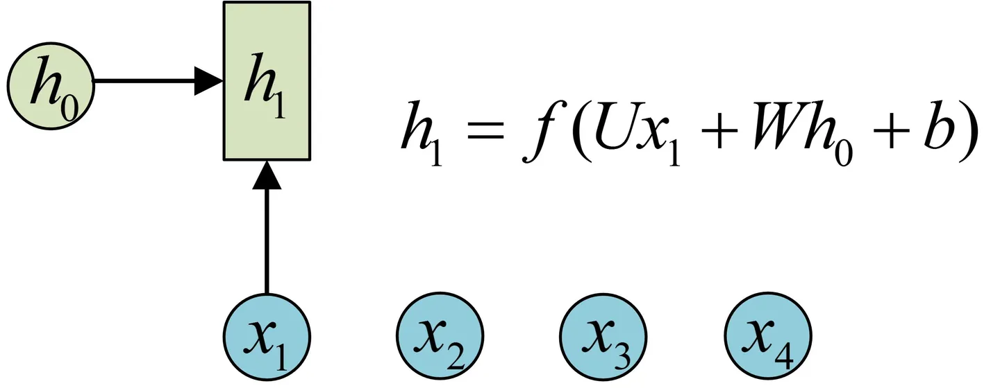
  >
  > h2的计算和h1类似。要注意的是，在计算时，**每一步使用的参数U、W、b都是一样的，也就是说每个步骤的参数都是共享的，这是RNN的重要特点，一定要牢记。**
  >
  > 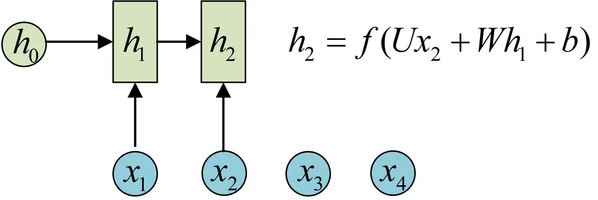
  >
  > 依次计算剩下来的
  >
  > 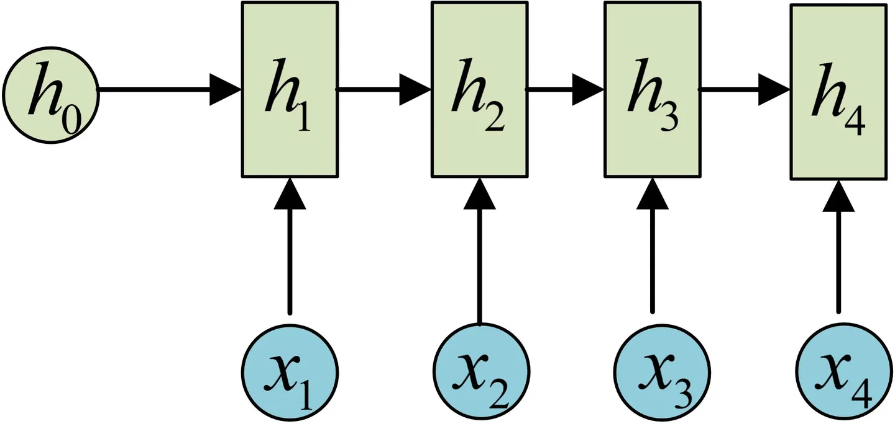
  >
  > 得到输出值的方法就是直接通过h进行计算
  >
  > 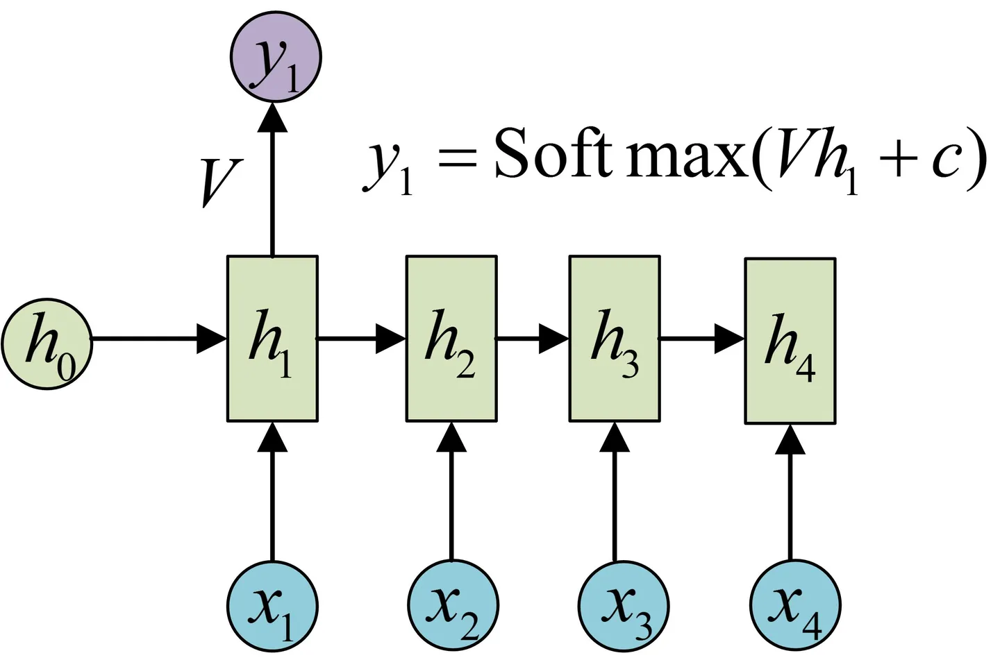
  >
  > **一个箭头就表示对对应的向量做一次类似于f(Wx+b)的变换，这里的这个箭头就表示对h1进行一次变换，得到输出y1。**
  >
  > 剩下的输出类似进行（使用和y1同样的参数V和c）：
  >
  > 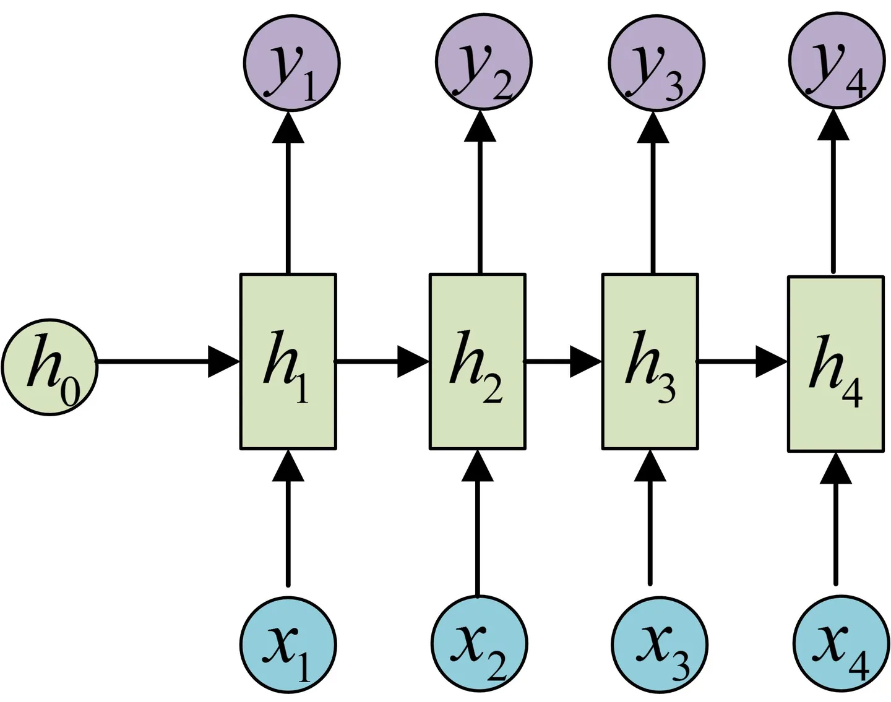
  >
  > 这就是最经典的RNN结构，我们像搭积木一样把它搭好了。它的输入是x1, x2, .....xn，输出为y1, y2, ...yn，也就是说，**输入和输出序列必须要是等长的**。
  >
  > 由于这个限制的存在，经典RNN的适用范围比较小，但也有一些问题适合用经典的RNN结构建模，如：
  >
  > - 计算视频中每一帧的分类标签。因为要对每一帧进行计算，因此输入和输出序列等长。
  > - 输入为字符，输出为下一个字符的概率。这就是著名的Char RNN（详细介绍请参考：[The Unreasonable Effectiveness of Recurrent Neural Networks](https://link.zhihu.com/?target=http%3A//karpathy.github.io/2015/05/21/rnn-effectiveness/)，Char RNN可以用来生成文章，诗歌，甚至是代码，非常有意思）。

* # N vs 1 输入N输出1

  > 有的时候，我们要处理的问题输入是一个序列，输出是一个单独的值而不是序列，应该怎样建模呢？实际上，我们只在最后一个h上进行输出变换就可以了：
  >
  > 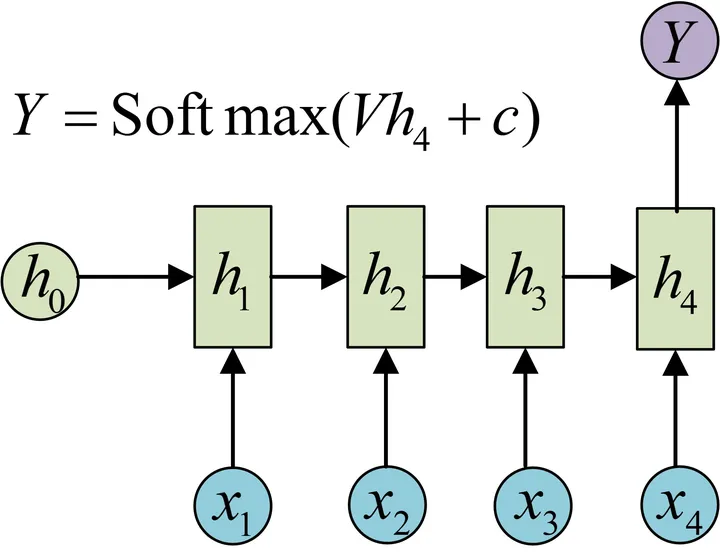
  >
  > 这种结构通常用来处理序列分类问题。如输入一段文字判别它所属的类别，输入一个句子判断其情感倾向，输入一段视频并判断它的类别等等。

* # 1 vs N 输入1输出N

  > 方法一：只在开始
  >
  > 
  >
  > 方法二：把X作为每个阶段的输入
  >
  > 
  >
  > 这种1 VS N的结构可以处理的问题有：
  >
  > - 从图像生成文字（image caption），此时输入的X就是图像的特征，而输出的y序列就是一段句子
  > - 从类别生成语音或音乐等

* # N vs M 输入N输出M

  > Encoder-Decoder模型，也称为Seq2Seq
  >
  > **Encoder-Decoder结构先将输入数据编码成一个上下文向量c：**
  >
  > 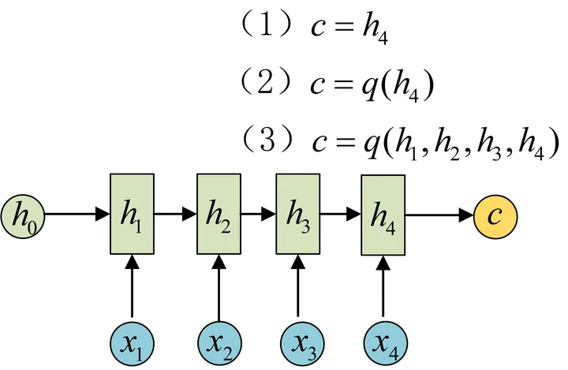
  >
  > 得到c有多种方式，最简单的方法就是把Encoder的最后一个隐状态赋值给c，还可以对最后的隐状态做一个变换得到c，也可以对所有的隐状态做变换。
  >
  > **拿到c之后，就用另一个RNN网络对其进行解码**，这部分RNN网络被称为Decoder。具体做法就是将c当做之前的初始状态h0输入到Decoder中：
  >
  > 
  >
  > 还有一种做法是将c当做每一步的输入：
  >
  > 
  >
  > 由于这种Encoder-Decoder结构不限制输入和输出的序列长度，因此应用的范围非常广泛，比如：
  >
  > - 机器翻译。Encoder-Decoder的最经典应用，事实上这一结构就是在机器翻译领域最先提出的
  > - 文本摘要。输入是一段文本序列，输出是这段文本序列的摘要序列。
  > - 阅读理解。将输入的文章和问题分别编码，再对其进行解码得到问题的答案。
  > - 语音识别。输入是语音信号序列，输出是文字序列。
  > - …………

* # Attention机制

  > 在Encoder-Decoder结构中，Encoder把所有的输入序列都编码成一个统一的语义特征c再解码，**因此， c中必须包含原始序列中的所有信息，它的长度就成了限制模型性能的瓶颈。**如机器翻译问题，当要翻译的句子较长时，一个c可能存不下那么多信息，就会造成翻译精度的下降。
  >
  > Attention机制通过在每个时间输入不同的c来解决这个问题，下图是带有Attention机制的Decoder：
  >
  > 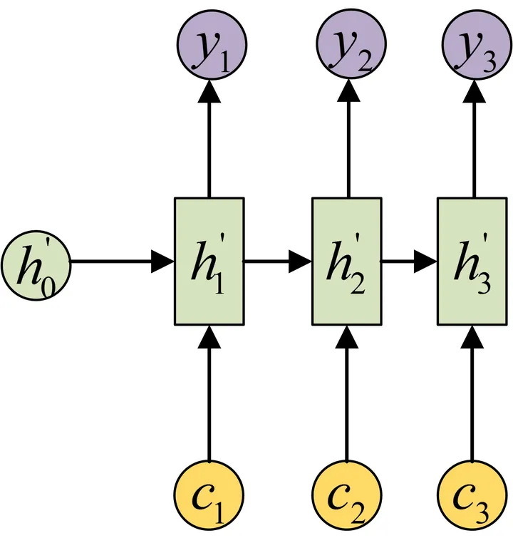
  >
  > **每一个c会自动去选取与当前所要输出的y最合适的上下文信息。具体来说，我们用$a_{ij}$衡量Encoder中第j阶段的hj和解码时第i阶段的相关性，最终Decoder中第i阶段的输入的上下文信息$c_i$就来自于所有$h_J$对$a_{ij}$的加权和。**
  >
  > 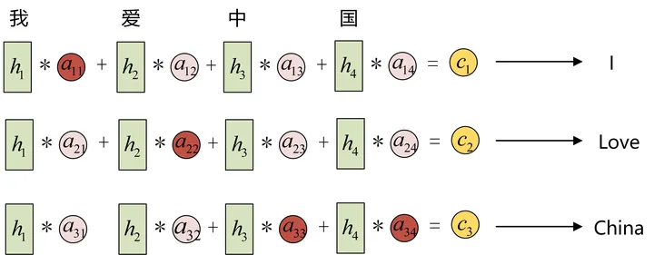
  >
  > 输入的序列是“我爱中国”，因此，Encoder中的$h_1$、$h_2$、$h_3$、$h_4$就可以分别看做是“我”、“爱”、“中”、“国”所代表的信息。在翻译成英语时，第一个上下文$c_1$应该和“我”这个字最相关，因此对应的$a_{11}$就比较大，而相应的 $a_{12}$、$a_{13}$ 、$a_{14}$就比较小。$c_2$应该和“爱”最相关，因此对应的$a_{22}$ 就比较大。最后的$c_3$和$h_3$、$h_4$最相关，因此$a_{33}$ 、$a_{34}$的值就比较大。
  >
  > **那么，这些权重$a_{ij}$是怎么来的？**
  >
  > $a_{ij}$同样是从模型中学出的，它实际和Decoder的第i-1阶段的隐状态、Encoder第j个阶段的隐状态有关。
  >
  > 同样还是拿上面的机器翻译举例，$a_{1j}$的计算：
  >
  > 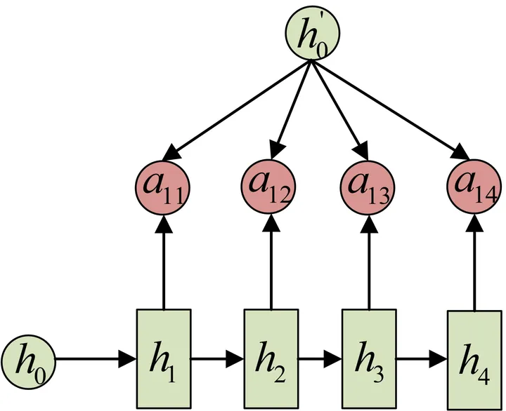
  >
  > $a_{2j}$的计算：
  >
  > 
  >
  > $a_{3j}$的计算：
  >
  > 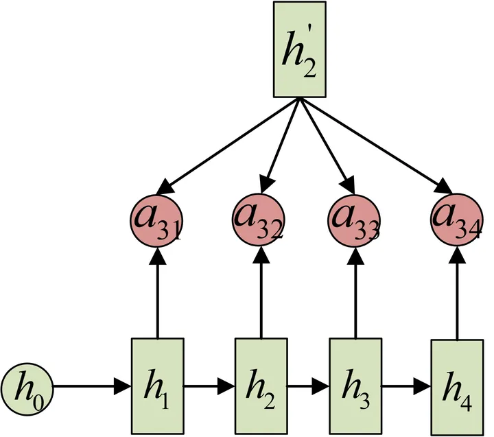
